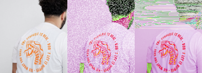

# Digital Migrations

## Digital Skills workshops at LICA


A series of workshop materials and links to think about the digital in fine art practice at LICA

### Getting Started

We are going to use in-browser tools made by the excellent multimedia designer/technologist [Georg AKA 'Snorpey'](https://fishnation.de/) that let you manipulate images:
 * [Glitching](https://snorpey.github.io/jpg-glitch/)
 * [Triangulation](http://snorpey.github.io/triangulation)
 * [Distorting Grid](http://snorpey.github.io/distort-grid)
 * [Contrast Distort](http://snorpey.github.io/contrast-distort/)

You can get to all of them from [here](http://snorpey.github.io/experiments/) including links to all the javascript code that made them, shared on the popular code sharing platform, github.

Each webpage is a web application that let's you drag and drop images from the desktop into the browser window and then distort them and export them. Although there are tonnes of things like this online, Snorpey has open sourced all its simple, contemporary javascript code to refer to on github so should someone want to take this on into their practice it is quite translatable into the well established artist friendly coding environment [Processing](https://processing.org/) some interaction software built for artists.

This means we dont have to worry about installing new software. It's also how most digital work is carried out now, using the Internet Browser (like Mozilla Firefox or Google Chrome) like a computer's 'operating system'. The `HTML` code loads the Javascript Snorpey has written to make the image processing work: you can really build pretty much anything a computer does into the browser. 

Processing itself can be downloaded but also used in a modern Internet Browser as [p5js.org](https://p5js.org/).

Even if you know very little digital image work and uninterested in coding you can quikcly manipulate and re-manipulate images easily without using more traditional image processing tools like Adobe Photoshop or the open source free alternative [GIMP](https://www.gimp.org/)

### Image Processing Exercise

 * Try getting an image with yourself onto the computer desktop and drag into the window of one of the webpages above and play with the controls;
 * Export one with the export or Download image button, or with the glitch choose Save in Browser from the menu and Download the image
 * Open another and drag the exported file into that.
 * Repeat until your face is completely destroyed

### 3D object making in the browser

Use OpenJSCAD (javascript implementation of OpenSCAD) in the browser

 * Open [OpenJSCAD.org](https://openjscad.org/) and select ALL of the code in the right panel and replace with this:

```
    function main(){
           return cube({size: 10, center: true})
              .translate([-20, -10, 12]);
                  }
```

 * Press SHIFT & RETURN (enter) and it will render the new code. Change some numbers, see what happens
 * You can export `.stl` files for 3d printing right from the browser like our [example above](models/cube.stl) and [this](models/Migrations.stl).
 * You can take screen grabs, clean up and drop into the snorpey glitching sites.

### Make your own dataset

Data does not have to be big. Im making my own based on times I drink coffee in a 4 hour period in the office.

Im going to plot the times I do that on a graph.


Then Im going to turn it into a list of graph plots

`[0, 0], [1, 1], [2, 1], [3, 0], [4, 1], [4, 0]`

In programming a list like this can be stored in an array

`var c = [[0, 0], [1, 1], [2, 1], [3, 0], [4, 1], [4, 0]];`

We're going to use this as a data source to draw a shape in thee OpenJSCAD browser by typing in [this bit of code](openjscad/coffeeGraph.jscad) into the code panel and using SHIFT & RETURN to render it

### Further Tools

Want to find out more about learning Processing maybe check out Dan Shiffman (Processing inventor) [Highly Enthusiastic video](http://hello.p5js.org/)

### Databending Images into Sound and back



Follow my [Instructions](imageAndSound/README.md) simplified from this Introduction to [Databending images with sound software](http://www.hellocatfood.com/databending-using-audacity/)

Using [Audacity](https://www.audacityteam.org/download/)

#### 3D design toward 3D printing and fabrication
 * [OpenSCAD](http://www.openscad.org/)
 * Or for a more simple design environment setup a free account for [TinkerCAD](https://www.tinkercad.com/)

#### Text and Data Mining
I made a series of tutorial and workshop materials based on manipulating data for the [Interactive Non Fiction Tools](https://gitlab.com/DomesticScience/InteractiveNonFiction) resources for [Domestic Science](http://domesticscience.org.uk).

We are going to checkout [some example datasets](https://gitlab.com/DomesticScience/InteractiveNonFiction/tree/master/chooseYourOwnAdventure/adventuresInText/datasets) that are 'hackable' in spreadsheet software like Microsoft Excel and use them as data to make shapes.

