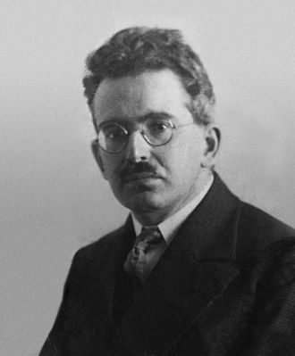

# Digital Migrations

## Digital Skills workshops at LICA




A series of workshop materials and links to think about the digital in fine art practice at LICA

### Getting Started

We are going to use in-browser tools that let you manipulate images:
 * [Glitching](https://snorpey.github.io/jpg-glitch/)
 * [Triangulation](http://snorpey.github.io/triangulation)
 * [Distorting Grid](http://snorpey.github.io/distort-grid)
 * [Contrast Distort](http://snorpey.github.io/contrast-distort/)

You can get to all of them from [here](http://snorpey.github.io/experiments/) including links to all the javascript code that made them.

You drag and drop images from the desktop into the browser window and then distort them and export them. Although there are tonnes of things like this online, snorpey has open sourced all its simple and contemporary javascript code to refer to on github so should someone want to take this on into their practice it is quite translatable into artist friendly coding with things like [Processing](https://processing.org/) some interaction software built for artists.

This means we dont have to worry about installing new software. It's also how most digital work is carried out now, using the Internet Browser (like Mozilla Firefox or Google Chrome) as a computer. The HTML code can use Javascript code to make Snorpey's image processing workl you can really build pretty much anything a computer does into the browser. 
Processing itself can be downloaded but also used in a modern Internet Browser as [p5js.org](https://p5js.org/).

Even if you know very little digital image work you can manipulate and re-manipulate images easily

 * Try getting an image with yourself onto the computer and drag into the window of one of the webpages above and play with the controls;
 * Export one with the export or Download image button, or with the glitch choose Save in Browser from the menu and Download the image
 * Open another and drag the exported file into that.
 * Repeat until your face is completely destroyed

### 3D object making in the browser

Use OpenJSCAD (javascript implementation of OpenSCAD) in the browser

 * Open [OpenJSCAD.org](https://openjscad.org/) and select ALL of the code in the right panel and replace with this:

```
    function main(){
           return cube({size: 10, center: true})
              .translate([-20, -10, 12]);
                  }
```

 * Press SHIFT & RETURN (enter) and it will render the new code. Change some numbers, see what happens
 * You can export `.stl` files for 3d printing right from the browser like our [example above](models/cube.stl) and [this](models/Migrations.stl).
 * You can take screen grabs, clean up and drop into the snorpey glitching sites.

### Further Tools

Want to find out more maybe check out Dan Shiffman (Processing inventor) [Highly Enthusiastic video](http://hello.p5js.org/)

#### 3D design toward 3D printing and fabrication
 * [OpenSCAD](http://www.openscad.org/)
 * Or for a more simple design environment setup a free account for [TinkerCAD](https://www.tinkercad.com/)

#### Text and Data Mining
[Interactive Non Fiction Tools](https://gitlab.com/DomesticScience/InteractiveNonFiction)

