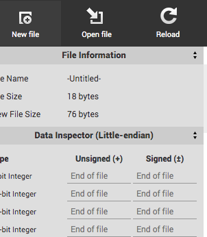
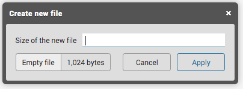
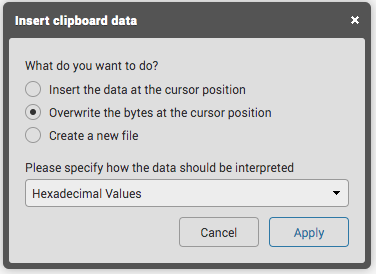
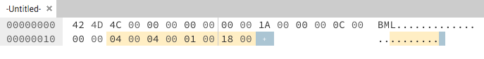
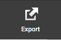
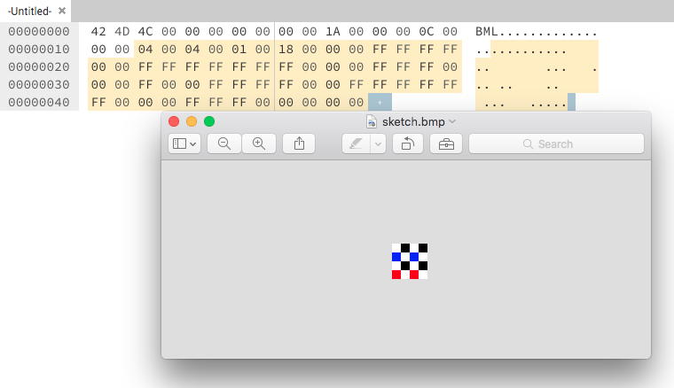
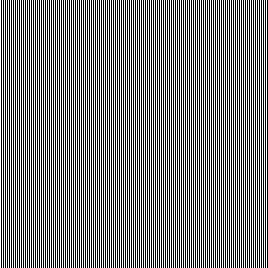
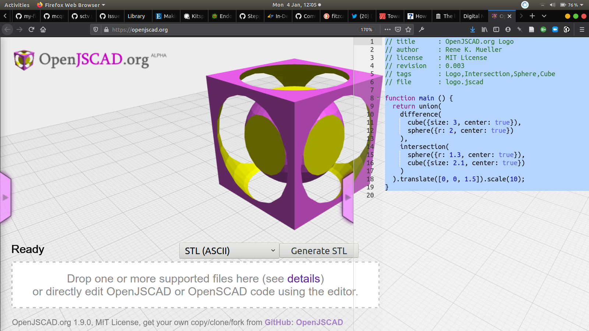
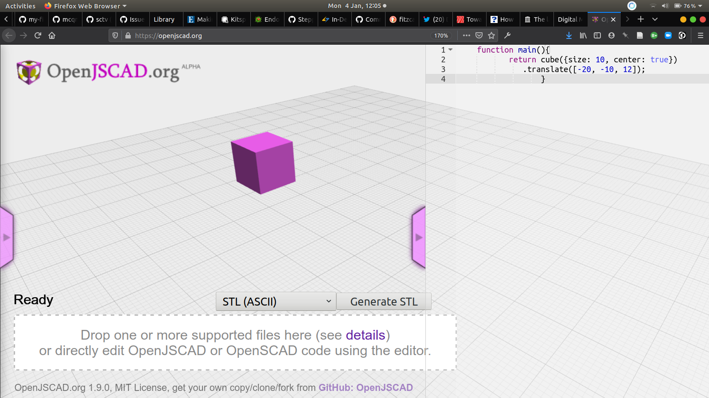

# Digital Migrations

## Data As Art Material


Hi welcome to the Data As Art Material workshop. You may have watched an introductory video to give this set of activities a bit more context. It's not essential but it gives some extra encouragement to thinking about using technology in art practice not just as a tool and a means to an end but more like a practice and a culture to participate in critically.

We expect you to attempt all of the activities below. Don't worry if some elements don't work out easily for you, just have a play around and focus on a particular section if it interests you especially.

In this workshop we provide some experiences of using 'data' as an art material that point to further learning and core literacy skills through practical examples of image manipulation and glitching, data visualisation and generation. We also think this can be a useful resource for you with all kinds of approaches and links you may come back to later in your studies.

This workshop is not about the sort of literacy you need to use tools like Adobe Photoshop or the open source equivalent [Gimp](https://www.gimp.org/) but an introduction to a practical approach to engaging critically with the digital and wider technical culture.

We wanted to think about the historical material nature of the 2D and 3D digital files that are part of the infrastructure of the many forms of digital art practices you might choose to develop.

* Image Glitching With Data
* Hand craft artisinal bitmap image files from scratch.
* Make your own data - not big data, small data - and applying that to generating 3D objects


# 1 📷

### Image Glitching


As an introduction we are going to use an in-browser tool i.e. a web page that contains javascript that is run in the page, made by multimedia designer/technologist [Georg AKA 'Snorpey'](https://fishnation.de/) that let you manipulate images:

 * [Glitching](https://snorpey.github.io/jpg-glitch/)
 * [Triangulation](http://snorpey.github.io/triangulation)
 * [Contrast Distort](http://snorpey.github.io/contrast-distort/)
 * [Distorting Grid](http://snorpey.github.io/distort-grid)

You can get to all of them from [the web page here](https://snorpey.github.io/experiments/) including links to all the javascript code that made them, shared on the popular code sharing platform, github.

Each webpage contains a web application that let's you drag and drop images from your desktop into the browser application window and then distort them and export them. Although there are many things like this online, Snorpey has 'open sourced' the javascript code by sharing it on github. Should someone want to make their own versions of these pages they can download the code and use it so if you're curious you can [explore it on github](https://github.com/snorpey/triangulation/blob/develop/scripts/lib/triangulate-image-browser-with-polyfills.js).

It's the kind of thing you can do in well established coding environments like [Processing](https://processing.org/) interaction software built especially for artists and non-programmers which we'll look at in the next workshop. Processing itself can be embedded in a we Browser as [p5js.org](https://p5js.org/). We'll be looking and playing with that in the next workshop.

### Image Glitching Exercise

 * Try getting an image of your own onto the computer desktop and drag into the window of one of the webpages above and play with the controls; it's best not too large and compressed with a `.jpg` or `.png` extension: there is a limit to the amount of memory your a webpage can cope with.
 * **Play** around glithing the image with the sliders and **export** the result with the Export or Download image button, or choose Save in Browser option, depending on which glitch tool your using and **download** the image somewhere handy.
 * Open another different glitch tool and drag the exported file into that.
 * Repeat until your image is completely transformed

Even if you know very little about digital image manipulation or uninterested in coding you can quickly manipulate and re-manipulate images easily without using more traditional image processing tools like Adobe Photoshop or the open source free alternatives like [GIMP](https://www.gimp.org/) in a fraction of the time. Of course these are just 4 image manipulation effects; people use software like Photoshop or Processing to choose ***exactly*** what they want. But this is a bit more playful and spontaneous. You could take fragments of your exported images you like and re-work them in physical media; once you start manipulating in software there is no reason to stay on a computer.


### Thinking of Data As A Material 💭

Usually all the data stuff when we make digital images or video happens behind the scenes so you never think about it and for good reason; if you want to manipulate images in creative ways you often just want instant results. Then you can get on with the important stuff of making work.

Computer scientists have abstracted all the data stuff away so you can use it as a tool which is all good. However, thinking on a simple level of how a digital image is made up of individual 'pixels' with numbers assigned to it has it's advantages. When images are turned into a list of numbers; into data with a very specific schema or format, they can be 'translated' and manipulated in powerful ways. Just thinking of an image like this gives you access to a literacy in what your tools are actually doing which could lead to you making your own tools or using your existing ones in new ways. And literacy can lead to the intuition and development we often need in our art practices.

In many ways a digital image is not an image at all but more like an abstract 'spatial' map of related coordinates and numbers in a colour space that use a format or schema that other people and machines know about so they can be shared on phones, projectors, monitors, or inkjet printers.

So our image data 'maps', can be read into other formats just as someone drawing will map visual experience to marks on paper; images can be turned into sound, manipulated as if they were so and translated back into images.

You can also make up data that's not referring to sound or colour but perhaps record experiences or find data online.

This is a series of exercises to show that doing that is not that difficult, but sometimes you have to think of things a bit differently, like counting in a different number system...

### Gestures are data 🤟

After messing about with these webapps, Return to [Distorting Grid](http://snorpey.github.io/distort-grid) and notice that in the top right of the browser window is a faint `download transform data` button. The transformations you make warping the grid etc. are recorded on clicking this, and then exported as a form of data called `json`.

### JSON 📊

This is just an array or list of data with paired *names* and *values* that can be a string of text, numbers or a Boolean (that means either a `true` or `false` statement) that humans and machines can read. An example is below. You'd need to use Notepad or TextEdit to read it; it's just text.

```
 var myJson = [
 {
    "first": "John",
    "last": "Doe",
    "age": 39,
    "sex": "male",
    "salary": 70000,
    "registered": true
    },
 {
    "first": "Jane",
    "last": "Smith",
    "age": 42,
    "sex": "female",
    "salary": 80000,
    "registered": true
    },
    ];
```

If you open up the downloaded file with **Notepad** you'll see something a bit more abstract that describes the positions of the grid you transformed.

```
[{
		"points": [
			{
				"x": 0,
				"y": 0
			},
			{
				"x": 40,
				"y": 0
			},
			{
				"x": 0,
				"y": 40
			},
			{
				"x": 40,
				"y": 40
			}
		],
		"transforms": {
			"shape": {
				"scaleX": 1,
				"skewX": 0,
				"scaleY": 0,
				"skewY": 1,
				"translateX": 0,
				"translateY": 0
			},
			"image": {
				"scaleX": 1,
				"skewX": 0,
				"scaleY": 0,
				"skewY": 1,
				"translateX": 0,
				"translateY": 0
			}
		}
	},
```

There is no mention of your image; that's because the `.json` does not really care about it. It just records how you moved the grid in the 2D space using `x` and `y` or `LEFT/RIGHT`, `UP/DOWN`. The javascript code in the webpage just loads it in an image, maps it to a grid then when you move the grid it stretches the colour and brightness values across the transformation.

The most basic way of representing position is using variables `x` and `y` which you'll remember is a convention for describing `horizontal` and `vertical` positions on a graph. We could call them `time` or `chocolate eaten` but we only want our position data so it makes sense to use names like `x`.

We are not going to do anything with it but it shows simply how our interactions manipulating an image with Snorpey's little apps can be described as data. You could use a tablet and pen and record your hand gesture as easily as a mouse and describe it as `JSON`. Why? Well machines can then read the data and re-perform your gesture; this old largely archived project [Graffiti Markup Language](https://000000book.com/) was an attempt to share the gesture data of graffiti artists.

### About Github

You might notice that Snorpey's code and the actual webapps are hosted on GitHub. Our workshop materials are hosted on GitHub as is my artist webpage and pretty much all my work, even the project management of many of my more complicated projects with other artists and technologists, is linked to my GitHub account.

For me using github is a way of getting close to the particular technical people I work with by doing what they do, following their work practices which include using github to manage their [software projects](https://github.com/DoESLiverpool/) and the [management of their community and the makerspace where they work](https://github.com/DoESLiverpool/somebody-should/issues).

It's certainly not the only way to engage with technology but it can give you an interesting perspective. For instance you can find very interesting projects online like [Matter Farm](http://matter.farm/) where data on chemical compounds is captured and combined to generate new chemical combinations. With a bit of digging in the [about](http://matter.farm/about/) section of the website for the project you can find the sources of all the [data used](http://pubchem.ncbi.nlm.nih.gov/) and links to some of the interesting artists and technologists involved like [Francis Tseng](https://frnsys.com/) via his [github identity](https://github.com/frnsys/).

Understanding where data is stored, starting with something like GitHub, even if you don't fully understand it, gives you a rich area of research and a vast community of artists and technicians to look at and be inspired by.

 After a while you get used to 'mining' the credits and links when you see interesting digital work and if you do engage with this practice it can be useful to consider documenting your own working practice on platforms like github even if it's just a place to group together links and notes for free.

 If you're interested or a no-nonsense guide to using git try [Git-No-Deep-Shit](https://rogerdudler.github.io/git-guide/).

We'll go into more of that in the next workshop looking at [P5.js](https://p5js.org/) and the [Openprocessing Community](openprocessing.org/).


# 2 🖼️


## Hand Craft Image File From Scratch


We are going to use [Hexed](https://hexed.it/) to learn to count in Base 16 (Hexadecimal) and make our own `.bmp` files to get to know them a bit better inspired by [Chris Cuellar's blog on crafting digitally without stencils](http://magazine.art21.org/2011/09/13/how-to-create-a-bitmap-image-file-by-hand-without-stencils/).

### Crafting Data, Sketching in Base 16

In the age of automation, software tools, and outsourced development, how can any digital artist expect to be taken seriously, if the "labor" expended is a matter of keeping up a Tumblr blog or printing out and blowing up Photoshop gradients? Is there some kind of heroic equivalent to making digital images from scratch, "by hand" and "without stencils?" Look no further! In this tutorial we will be showing you how to create a [Bitmap Image File](https://en.wikipedia.org/wiki/BMP_file_format#Example_1) (`.bmp`).


A `.bmp` file, like any image file, is a matrix of pixels sized a particular width by a particular height. We will be creating our `.bmp` from scratch, by typing in machine code bit by bit.  When one hears the term "machine code," binary-code is likely the first thing that comes to mind. For this tutorial, however, we'll be working in Hexadecimal.

In order to write in Hex code you'll need a hex editor. We'll use an online one called [Hexed.it](https://hexed.it/)

**Hexadecimal Numbers**
Hexadecimal is base 16, this means it is a numerical system which uses 16 characters, `0` through `9` and `A` through `F`. We've put together a chart for you to use as a "cheat-sheet" until you get used to writing in hex.


**Decimal to Hexadecimal Converter**

 | | | | | | | | | | | | | | |
--|--|--|--|--|--|--|--|--|--|--|--|--|--|--|--
0|1|2|3|4|5|6|7|8|9|10|11|12|13|14|15
0|1|2|3|4|5|6|7|8|9|A|B|C|D|E|F

If you were to continue adding to this chart, decimal 16 would be hexadecimal 10, 17 would be 11, 18 would be 12 and if we jumped a bit further, 26 would be hexadecimal 1A, 27 would be 1B, 28 would be 1C, 45 would be 2D and so on. You can find more comprehensive examples [here](https://www.mathsisfun.com/hexadecimals.html) but we wont actually need to count in hexadecimal.

We'll be converting larger numbers into hex a bit later on in this tutorial, when we set our `.bmp`'s width and height.  

**Hexadecimal Colors**

Now that we understand how regular numbers translate to hex we'll take a look at colors. If you are a web developer or you use Photoshop you might already be familiar with hex color values. You might already know that `FFFFFF` translates to white and `000000` to black, but why? It's actually very simple: each pixel in a `.bmp` has a red value, a blue value and a green value. These values can range from 0 to 255, which is 00 -- FF in hexadecimal. A pixel contains 6
characters, or three sets of two, one set for each value R, G and B. So if I wanted to make a pixel red, I would type `FF0000`, setting my red value to the max of FF while maintaining my green and blue values at 00.

**File Header**

Now that we understand the basics of Hexadecimal numbers and colors we can start a small sketch. All data files have a ***header*** at the start of the file so computers know what to do with it and to check it's a valid file. Just like all other files, every `.bmp` file contains two sections, the file's header followed by the image data. The header is the first couple of lines of code which contains the file's basic information (what kind of file it is, what its dimensions are, etc.)

Lets go ahead and open up [Hexed.it](https://hexed.it/).

Make a new file with the new file icon in the top left of the browser window.



You'll get a pop up window asking you what size of file. Just click `Empty file` for now and `Apply`



Now we can start creating our header in the window where you'll see the cursor flashing. The first thing we'll need is some basic `.bmp` info, type the following code into your file:

```
42 4D 4C 00 00 00 00 00 00 00 1A 00 00 00 0C 00 00 00
```

You can cut and paste it once you've moved the cursor to the next available space. Use `ctrl` & `c` to copy and `ctrl` & `v` to paste or right click. When you go to paste you'll be asked how to paste in a dialogue window. You need to choose overwrite and the hexadecimal option like below.



Next we'll need to set our `.bmp`'s dimensions. We'll keep it small for
this first sketch, lets make our width four pixels wide:

`04 00`

Lets also set our height to four pixels:

`04 00`

Last, we'll type in some more standard `.bmp` header code:

`01 00 18 00`

We've now finished setting up our header, if you did this right it
should look like the image below:



**Image Data**

Here's where we start typing our pixels. Usually `.bmp` files read from right to left and bottom to top, which is the exact opposite of the way we read words on a page and can get confusing! The particular kind of `.bmp` we set up in this file will also read bottom to top, but will read left to right instead of right to left, which will make things a bit easier for us. So the first pixel we type will be showing up on the bottom left hand corner of our `.bmp` image and the last pixel will show up on the top right hand corner. As if things weren't backwards enough, we'll also be writing our color values backwards, this mean B-G-R, Blue, Green, Red, rather than the more familiar R-G-B color values you might know already.

Once we've wrapped our heads around that, we can start typing our first row (i.e. bottom row). Lets set it up to alternate between red and white pixels. First I'll type my red pixel:

`00 00 FF`

Think of it like "Blue = Zero amount, Green = Zero Amount, Red = Maximum which gives me red"

Next we'll type our white pixel:

`FF FF FF`

or "Blue = Max amount, Green = Max Amount, Red = Max which gives me white"

Because we set up our `.bmp` to be 4px wide, we still need two more pixels to finish off our first row; let's type one more red pixel and one more white pixel:

`00 00 FF FF FF FF`

That should finish off our bottom row. (of the image, that is) For the next row we'll alternate between white and black pixels. First we'll type out a white pixel, then a black one, then white again, then black again:

`FF FF FF 00 00 00 FF FF FF 00 00 00`

For the next row we'll alternate between blue and white:

`FF 00 00 FF FF FF FF 00 00 FF FF FF`

And for the last row (which visually will be our first row), we'll
alternate between white and black again:

`FF FF FF 00 00 00 FF FF FF 00 00 00`

At this point we've typed out four rows, each four pixels wide. We can't type any more pixels because we only set our image dimensions to 4×4 pixels. The last thing we need to finish off our file is a little padding. Type in four zeroes and you're finished:

`00 00`

Now export your file and it will be downloaded as a file with no name called `-Untitled-`. Download it and find it on your computer and rename it `sketch.bmp`. Make sure you include the file extension. You may need to change your windows settings to see file extensions. Then open it up in an image editor, the default application should do it. Where is it? Well it's only 4x4 pixels so you'll need to zoom right in!



It should look like the image below:




Remember, the `.bmp` file you just created is only 4px wide by 4px high.  This means when you open it up in Preview you'll have to zoom in a bit before you can see your pixels. If your image doesn't look like the one above you likely mistyped some code. Take a close look at the image above and check your file line by line.

Try changing the colours of pixels, you may need to refer to previous steps to map out which bits are the header, bottom row, top row, padding etc. Have a look at the image of the `.bmp` file structure. If you want to delve further try making larger compositions in the guide below. We'll include [this file](hexdump.md) with the 430,944 characters required to copy & paste to make  a .bmp with a width of 268 and height of 268 pixels!

**Creating Larger Compositions**

It was easy to set up our file with a width and height of four pixels because the decimal "4" translates to the hexadecimal "4." If we had set up a larger `.bmp`, say 13px by 13px, our header would have looked like this:

`42 4D 7C 00 00 00 00 00 00 00 1A 00 00 00 0C 00 00`<span style="background-color: yellow;">`00 0D 00
0D`</span> `00 01 00 18 00`

Notice that the section in our header which contains the width and height are set to hexadecimal `0D` where it used to say `04`; this is because (as our chart demonstrates above) 13 translates to `D` in hex code. But what if we want to set up an image that's much larger, say for example 268px by 268px?

Our new header should look like this:

`42 4D 7C 00 00 00 00 00 00 00 1A 00 00 00 0C 00 00 00`<span style="background-color: yellow"> `0C 01 0C 01` </span> `01 00 18 00`

That wasn't so hard! However, a `.bmp` with a dimension of 268px by 268px will have 71,824 pixels in it. Each pixel contains 6 characters (white = FF FF FF), which means our new sketch will have a total of 430,944 characters following the header info! I dont advise trying this, if your file is missing or has added even one character your `.bmp` won't work. You would have to copy the characters below - representing 268 pixels across - 268 times! If you really want to try it dont forget to end it with `00 00 00` to pad out the end of the last (top) pixel.

```
FF FF FF 00 00 00 FF FF FF 00 00 00 FF FF FF 00 00 00 FF FF FF 00 00 00 FF FF FF 00 00 00 FF FF FF 00 00 00 FF FF FF 00 00 00 FF FF FF 00 00 00 FF FF FF 00 00 00 FF FF FF 00 00 00 FF FF FF 00 00 00 FF FF FF 00 00 00 FF FF FF 00 00 00 FF FF FF 00 00 00 FF FF FF 00 00 00 FF FF FF 00 00 00 FF FF FF 00 00 00 FF FF FF 00 00 00 FF FF FF 00 00 00 FF FF FF 00 00 00 FF FF FF 00 00 00 FF FF FF 00 00 00 FF FF FF 00 00 00 FF FF FF 00 00 00 FF FF FF 00 00 00 FF FF FF 00 00 00 FF FF FF 00 00 00 FF FF FF 00 00 00 FF FF FF 00 00 00 FF FF FF 00 00 00 FF FF FF 00 00 00 FF FF FF 00 00 00 FF FF FF 00 00 00 FF FF FF 00 00 00 FF FF FF 00 00 00 FF FF FF 00 00 00 FF FF FF 00 00 00 FF FF FF 00 00 00 FF FF FF 00 00 00 FF FF FF 00 00 00 FF FF FF 00 00 00 FF FF FF 00 00 00 FF FF FF 00 00 00 FF FF FF 00 00 00 FF FF FF 00 00 00 FF FF FF 00 00 00 FF FF FF 00 00 00 FF FF FF 00 00 00 FF FF FF 00 00 00 FF FF FF 00 00 00 FF FF FF 00 00 00 FF FF FF 00 00 00 FF FF FF 00 00 00 FF FF FF 00 00 00 FF FF FF 00 00 00 FF FF FF 00 00 00 FF FF FF 00 00 00 FF FF FF 00 00 00 FF FF FF 00 00 00 FF FF FF 00 00 00 FF FF FF 00 00 00 FF FF FF 00 00 00 FF FF FF 00 00 00 FF FF FF 00 00 00 FF FF FF 00 00 00 FF FF FF 00 00 00 FF FF FF 00 00 00 FF FF FF 00 00 00 FF FF FF 00 00 00 FF FF FF 00 00 00 FF FF FF 00 00 00 FF FF FF 00 00 00 FF FF FF 00 00 00 FF FF FF 00 00 00 FF FF FF 00 00 00 FF FF FF 00 00 00 FF FF FF 00 00 00 FF FF FF 00 00 00 FF FF FF 00 00 00 FF FF FF 00 00 00 FF FF FF 00 00 00 FF FF FF 00 00 00 FF FF FF 00 00 00 FF FF FF 00 00 00 FF FF FF 00 00 00 FF FF FF 00 00 00 FF FF FF 00 00 00 FF FF FF 00 00 00 FF FF FF 00 00 00 FF FF FF 00 00 00 FF FF FF 00 00 00 FF FF FF 00 00 00 FF FF FF 00 00 00 FF FF FF 00 00 00 FF FF FF 00 00 00 FF FF FF 00 00 00 FF FF FF 00 00 00 FF FF FF 00 00 00 FF FF FF 00 00 00 FF FF FF 00 00 00 FF FF FF 00 00 00 FF FF FF 00 00 00 FF FF FF 00 00 00 FF FF FF 00 00 00 FF FF FF 00 00 00 FF FF FF 00 00 00 FF FF FF 00 00 00 FF FF FF 00 00 00 FF FF FF 00 00 00 FF FF FF 00 00 00 FF FF FF 00 00 00 FF FF FF 00 00 00 FF FF FF 00 00 00 FF FF FF 00 00 00 FF FF FF 00 00 00 FF FF FF 00 00 00 FF FF FF 00 00 00 FF FF FF 00 00 00 FF FF FF 00 00 00 FF FF FF 00 00 00 FF FF FF 00 00 00 FF FF FF 00 00 00 FF FF FF 00 00 00 FF FF FF 00 00 00 FF FF FF 00 00 00 FF FF FF 00 00 00 FF FF FF 00 00 00 FF FF FF 00 00 00 FF FF FF 00 00 00 FF FF FF 00 00 00 FF FF FF 00 00 00 FF FF FF 00 00 00 FF FF FF 00 00 00 FF FF FF 00 00 00`
```

Anyway here's one the original blogger made and a simpler black and white one I generated by copying the above





# 3 📦

## Another Dimension: 3D Object Making


[OpenSCAD](http://www.openscad.org/) is a tool for making 3D and 2D shapes with data and code. Unlike really great free 3D CAD software like [FreeCAD](https://www.freecadweb.org/) and [Tinkercad](tinkercad.com/) which are great and much like drawing in Adobe Illustrator, this generates 3D objects programmatically.

Again, there's now a version of OpenSCAD that runs in a webpage. So we are going to play with OpenJSCAD (javascript implementation of OpenSCAD) in the browser, which allows you to write code directly into the webpage and "run" the code and see what happens

 * Open [OpenJSCAD.org](https://openjscad.org/)



Now highlight the existing code in the right side panel of the webpage, that is generating the sphere within a cube shape you can see when you first load up and replace it with the code below.


```
    // title My_First_Model
     // author You

    function main(){
           return cube({size: 10, center: true})
              .translate([-20, -10, 12]);
                  }
```
<br>




Your code should now look like the above. Now press `SHIFT` & `RETURN` (enter) or `F5` and it will render the new code and you should see a much more simple cube. Now go change some of the numbers, see what happens and see what that code is doing.

Talk yourself through it in plain language: "Make a function called main which is what always gets run first, and get the function to `return` IE 'give you back' a cube size 10 mm with the centre at your starting coordinate, and then translate the starting coordinate to a different position in space x = -20, y=-10 and z=12"

Keep playing and then have a play with the examples in the left pull out tab.

If you like you can try the following

 * You can export `.stl` files for 3d printing right from the browser window. Look at this [example](https://github.com/cheapjack/DigitalMigrations/blob/master/models/cube.stl) and [this one.](https://github.com/cheapjack/DigitalMigrations/blob/master/models/Migrations.stl) They are both generated from this web page. Many computers have built in previews of `.stl` files, but if yours doesnt try this [online STL viewer](https://www.viewstl.com/)

 * You could take screen grabs and drop into the snorpey glitching sites we used at the beginning.

 * You can also export 2D shapes with OpenSCAD as `.svg` files for using in other software or for laser cutting or CNC milling.

If you really like this there's a great way of learning how the code works through the [OpenSCAD Blocks](https://www.blockscad3d.com/editor/) project which adds a really good visual interface for learning the SCAD markup -  the code language that generates all the shapes by representing the code as lego-like blocks you can put together and then translate as code easily.

Finally it's worth downloading the full OpenSCAD once you get experienced and reading the [OpenSCAD Documentation](https://en.wikibooks.org/wiki/OpenSCAD_User_Manual) and refer to the handy [Cheatsheet](http://www.openscad.org/cheatsheet/) and some great [tutorials here](https://www.openscad.info/)

For our little experiments the online implementation, OpenJSCAD adds javascript to the language which can be confusing if you don't know any, its really just a cool implementation that might suit people making browser/online tools for generating 3D shapes. You're much better using the OpenSCAD software really.


## DIY dataset 🔧


We're going to go back to 2 dimensions for a moment and generate more data, not just with our mouse but with our day to day routine. Data does not have to be big. I'm making my own based on times I drink coffee in a 4 hour period in the office.

Im going to plot the times I do that on a graph.


Then Im going to turn it into a list of graph plots

`[0, 0], [1, 1], [2, 1], [3, 0], [4, 1], [4, 0]`

In most programming languages this 'paired' data can be made into a list like this, it's not as complex as `json` and can be stored in a type of variable called an ***array***. Javascript handles all kinds of variable types, you just have to 'declare' what you want to call it and format it like this.

`var c = [[0, 0], [1, 1], [2, 1], [3, 0], [4, 1], [4, 0]];`

We're going to use this array of graph plots as a data source to draw a shape in the OpenJSCAD browser by copying [this bit of code](https://raw.githubusercontent.com/cheapjack/DigitalMigrations/master/openjscad/coffeeGraph.jscad) and pasting into the code panel and using SHIFT & RETURN to render it.

```
// title      : Rectangular Extrude from graph coordinates
//              of how many times I drank coffee over 4 hours
// author     : Ross Dalziel
// license    : WTFPL License
// description: testing rectangular_extrude() function
//              by calling another function which returns
//              an array of coordinates
// file       : coffeeGraph.jscad

// define an array to draw a polygon
// a list of coordinates, say from a hand drawn
// graph of number of time you have coffee
function getShapeCoords() {
    // define an array called c
    var c = [[0, 0], [1, 1], [2, 1], [3, 0], [4, 1], [4, 0]];
    // make it spit out the contents of c when you
    // call the function
    return c;
}

// define a scalar, how much to scale the shape
var scalar = 8;
// define the main function that returns the 3D shape
function main () {
      // square brackets after return means you can return a
      // list or array of shapes
      return [
          // getShapeCoords() just gets all the
          // coordinates of your graph points and returns
          // the shape by extruding within the bounds
          // of the graph
          rectangular_extrude(getShapeCoords(), {closed: true}).scale([scalar,scalar,scalar])
          ];
}
```

You'll notice that line 15 of that code are my graph plots. Now make your own graph and call the axes whatever you want to represent anything you want. You can add plot point and make it as complex as you like.

### Drawing is mapping to

The exercise above maps data spatially into a shape you can 3D print, but of course we could do this with drawing just as well. Get some [Graph paper](http://www.printfreegraphpaper.com/) trace a single line over something and then draw `x` and `y` axes around them and plot this in a regular fashion. Use the grid to help and generate a list of numbers which are the **spatial coordinates** of the line you have drawn.

Then type this list to replace the `var c` list on line 15 and see what happens..

## The End

This is the end of the activity we expected you to try. Below is some extra information if you're interested. We hope you have found it useful and join us for the Q&A on January 20th 2021 12pm-1pm if you have any questions.

## Further Tools & Research

Below is just a collection of further research if you're interested and find it valuable.

### 3D design tools toward 3D printing and fabrication
 * [OpenSCAD](http://www.openscad.org/)
 * [OpenSCADBlocks Editor](https://www.blockscad3d.com/editor/) Online editor lets you import `.stl` files from places like [Thingiverse](http://thingiverse.com/) or the topography data described below
 * Or for a more simple design environment setup a free account for [TinkerCAD](https://www.tinkercad.com/)

#### Topography Data

Want to print out `.stl` files from your local topography on Google Maps? Have a look at [Terrain2STL](http://jthatch.com/Terrain2STL/) and try importing to tinkercad or OpenSCAD

I've made a model of the topography around [LICA here for you to look at](https://github.com/cheapjack/DigitalMigrations/blob/master/models/Bailrigg.stl)


### Going Further: Coding for Artists

Of course the way to really use data is using programming languages designed to do this. In the next workshop we'll be playing around with  [Processing](http://processing.org). Check out Dan Shiffman's (Processing inventor) [Highly Enthusiastic video](http://hello.p5js.org/) and we'll go into more of that in the next workshop looking at [P5.js](https://p5js.org/), which is an implementation (ie a version) of processing that works in a webpage and the [Openprocessing Community](openprocessing.org/) where the processing community share their code and tutorials.

### Data Sources

If you really take this further you can start using all kinds of data to play with which we will touch on in the next workshop.

Name|Link|Notes
---|---|---
UK Data Service|[UK Data Service](https://www.ukdataservice.ac.uk/get-data/key-data)|UK's largest collection of social, economic and population data for research and teaching purposes covering a range of different disciplines.
Planet Parts|[Planet Parts](https://planet.parts/)|All kinds of environmental data
`data.gov.uk`|[data.gov.uk](https://data.gov.uk/)|Official big and small UK Government data
DroneWars|[UK Drone Strikes against 'ISIS'](https://dronewars.net/2019/11/05/uk-drones-more-likely-to-target-individuals-than-infrastructure-data-analysis-reveals/)|Tracking drone strikes for journalism
Armed Conflict Location & Event Data Project (ACLED)|[ACLED](https://www.acleddata.com/dashboard/)|disaggregated data collection, analysis, and crisis mapping project

Stuck for more spurious correlations in data? [Spurious Correlations](http://www.tylervigen.com/spurious-correlations)

### Physical Data

If you're interested in recording data from sensors it's worth looking at using microcontrollers like [Arduino](https://www.arduino.cc/), [Raspberry Pi](https://www.raspberrypi.org/) and following the tutorials you can find at [Adafruit](https://www.adafruit.com/)


## Artists who use Data

Example established artistic practices that use data

#### Data Art & Activism


 * [James Bridle](http://jamesbridle.com/works) is a journalist and artist uncovering the infrastructure of our now ubiquitous data culture and is really an early adoptor of participating in technical culture.

 * [Forensic Architecture](https://www.forensic-architecture.org/) famously won the 2018 Turner Prize and challenge what artists (or architects) are meant to do at all

 * [Julian Oliver](https://julianoliver.com/output/) started out doing high end yet philosophically straightforward media-interaction work like [Fijuu](https://www.fact.co.uk/projects/dingdong/julian-oliver-pix-fijuu) which I curated back in 2008, to developing the [Critical Engineering Manifesto](https://criticalengineering.org/) and [making work and projects](https://julianoliver.com/output/) on the edge of speculative design and tools for network activism. Pre-dating james bridle Julian continues to make fascinating confrontational work responding to hidden in plain site disinformation and activist repression like in the Assange case, which makes you wish you had your own [Transparency Grenade](https://transparencygrenade.com/)

 * [Lucy Kimbell](http://www.lucykimbell.com/LucyKimbell/Projects.html) Artist and researcher, writer and strategic design in social innovation. Considering and participating in wider data cultures can help sustain an artistic practice

 * Directory of data artists from an exhibition  [Big Bang Data Project at Somerset House](http://bigbangdata.somersethouse.org.uk/artists/)

 * [Ellie Harrison](https://www.ellieharrison.com/), a self confessed recovering data addict who has been recording how much she swims every day for years until she swims the atlantic. Also famously connected a vending machine to austerity data, campaigns to [Bring Back British Rail](https://www.bringbackbritishrail.org/) and got roasted by the Daily Record for an Arts Council Funded Project for her to only work within the Greater Glasgow Strathclyde region to reduce her carbon footprint.

 * [Sam Thulin](http://www.lancaster.ac.uk/cemore/author/sthulin/) does a [Data Sensor Drone-By](http://www.lancaster.ac.uk/cemore/drone-over-data-centre/)

 * [Drone Strike Journalism](https://www.thebureauinvestigates.com/projects/drone-war)

 How we find and research digital art practitioners can be influenced by a literacy in platforms like GitHub now that more and more artists are engaged in digital technical practice and culture; The [matterfarm](http://matter.farm/about/) project includes a small link to the code used, [molecule discovery](https://github.com/frnsys/molecule_discovery) allowing you to track back and discover the developer/artist of the project [Francis Tseng](https://github.com/frnsys) and their other projects.


### Glitchers


Rosa Menkman "vernacular of file formats"

Nick Briz "glitch codec tutorial" [video](https://www.youtube.com/watch?v=hOemlx2sBIo)

Takeshi Murata ["pink dot"](https://www.youtube.com/watch?v=eZkY6zFbwgQ)

Phillip Sterns ["glitch textiles"](https://www.glitchtextiles.com/)

#### Data Textiles and Painting


[Dan Hays](http://danhays.org/coloradosnow3.html) work hand takes the abstracted cartesian 'image maps' back to their material artefacts through hand painting pixels. Ironic that programmers spend years on the data architecture of images for convenience only for the image makers to un-convenience it almost in protest.


[Sam Meech](http://smeech.co.uk) makes very interesting takes on very simple digital images and translates them with knitting machines, video, performance and interaction

ttps://frnsys.com/
