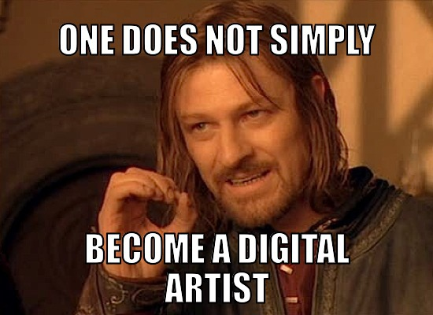

# Digital Migrations

[Full source files here](https://github.com/cheapjack/DigitalMigrations)

## Year 1 Class 2




### Adventures in Processing


Processing is a programming environment developed specifically **for artists** to make interactive digital work online and for installations. It's incredibly powerful. We are going to look at the most recent developments in [p5.js](https://p5js.org) which is processing for the contemporary web browser. It means you can display it on pretty much any browser and offers scope for mobile devices and cheap ways to build installations on more modest platforms like Raspberry Pi rather than having to have a big energy hungry PC hidden behind the scenes.

I like it because learning processing this way you also learn javascript which most of the web is run on so plenty of transferable skills.

It also makes playing and sharing with other people really easy as we shall see by using the [openprocessing](http://openprocessing.org) website, to hack and play with processing code.

# 1

## Getting Started

We'll be working through some of the [Learning Resources](https://p5js.org/learn/). We'll start with shape making and the basic coordinate system in Processing. Then we'll look into images. You can look up everything in the [Reference](https://p5js.org/reference/)
and play with [Examples](https://p5js.org/examples/). Finally when it comes to publishing ie displaying your work beyond openprocessing and your own computer we'll look into the the [Get Started Tutorial](https://p5js.org/get-started/)

First off let's get setup on [openprocessing](http://openprocessing.org) where we are going to work

### Throw Some Shapes

Let's start simply

We are going to follow the [Basic shape drawing](https://p5js.org/learn/coordinate-system-and-shapes.html) tutorials by reading along and pasting into an openprocessing sketch.

I've also combined it into a [sketch file called robotmover.js on openprocessing here](https://www.openprocessing.org/sketch/771430)

The code is below

```
// OK the first line of this code is "//" which processing or javascript ignores
// So you can write comments. We saw this in earlier classes. It's a useful
// convention so that when you or others return to the code they'll
// understand what you were trying to do!
// for longer commments with multiple lines you can
/* use this
and it will comment
out
all the lines following until you end it with
*/
// now you'll see the code below light back up.
// All processing sketches call a setup() and draw() function
// A function is an object that when you 'call' it it runs the code in it's curly brackets
//
// Setup a useful value for later
let x = 0;

function setup(){
    createCanvas(100, 100);
    rectMode(CENTER);
    //noLoop();
    //rectMode(CORNERS);
}

function draw(){
    point(40, 50); // point(x, y)
    //line(10, 20, 50, 20); // line(x1, y1, x2, y2)
    //rect(10, 20, 40, 30); // rect(x, y, width, height)
    //ellipse(30, 30, 40, 60); // ellipse(x, y, width, height)
    //background(200);
    //robot(x,100);
    //x++;
}

// Robot Drawing function
// Don't forget to increase the canvas size

function robot(pos_x,pos_y){
    rect(pos_x,pos_y,20,100);
    ellipse(pos_x,pos_y-30,60,60);
    ellipse(pos_x - 19,pos_y-30,16,32);
    ellipse(pos_x+19,pos_y-30,16,32);
    line(pos_x-10,pos_y+50,pos_x-20,pos_y+60);
    line(pos_x+10,pos_y+50,pos_x+20,pos_y+60);
    }

    /*
    function mousePressed() {
          loop();
    }
    function mouseReleased() {
          noLoop();
    }
    */

```


We can follow up other basics like [Color](https://p5js.org/learn/color.html) later

# 2

### Gonna Make Memes

Adding text onto images is obviously a well known internet skill.

We'll be remaking the meme above in open processing which get's us using our coordinate knowledge while learning how to do text and cope with loading files and other assets  

First off paste this code into a new open processing sketch

```
// Digital Migrations 2019 @cheapjack tutorial for making memes
// with p5.js to get the hang of loading in external assets and drawing text
// and images
// setup the variable memeFont


// setup the variable img & myFont to store our image and font
let img;
let myFont;

// make a function to pre-load it before your sketch runs
// memes often use Impact.ttf a true-type font
function preload() {
  img = loadImage('boromir.jpg');
  myFont = loadFont('Impact.ttf');
}

// setup as usual
function setup() {
	//createCanvas(windowWidth, windowHeight);
	// make the canvas fit the meme img size
    // you use 'dot notation' which means you can access certain
    // predefined parameters to certain 'objects'
    // so you can also get the screen width of whatever device
    // you load the sketch on in a browser window  with
    // window.screen.width or window.screen.height
    createCanvas(img.width, img.height);
	background(0);
	image(img, 0, 0);
    fill(255,255,255);
    textFont(myFont);
	textAlign(CENTER);
    textSize(36);
    text('ONE DOES NOT SIMPLY', img.width/2, 50);
	text('DRAG DIGITAL IMAGES', img.width/2, img.height-60);
    text('INTO OUR PROCESSING SKETCHES', img.width/2, img.height-20);
    }

function draw() {
	// uncomment the below to preview what we'll be moving onto next
    //ellipse(mouseX, mouseY, 20, 20);
    }
```

Then go to the 3 dots on the top right for more options, click the file tab and import the [boromir](https://github.com/cheapjack/DigitalMigrations/blob/master/docs/images/boromir.jpg) and [Impact.ttf](https://github.com/cheapjack/DigitalMigrations/blob/master/p5Tutorials/assets/Impact.ttf)

You'll see how the code 'pre-loads' the images and font files the sketch needs

## Advanced Processing

Looking for some more advanced stuff like amazing generative physics? Daniel Schiffman (creator of Processing) has an amazing book that walks you through really advanced stuff to make work that feels alive. [The Nature of Code](https://natureofcode.com/book) is made for the Processing stand alone Application/Programme but he has 'ported' ie translated all of the code for p5.js so it works in OpenProcessing. [p5js Version of Nature Of Code Examples](https://github.com/nature-of-code/noc-examples-p5.js) 

I made a simple example drawing tool for [Cerys](https://www.openprocessing.org/sketch/835864). Run it and draw with the mouse or touch screen or imagine drawing on top of the screen with tracing paper, how will your drawing be affected by the randomness? 

# 3

## Publishing


One of the easiest ways to leave the cosy safety of openprocessing and onto the **world wild web** is to host project files on a computer or server on the internet. All you need is an `.html` file with a link to the processing libraries, a `sketch.js` javascript file; other resources like snazzy css etc can be added later; and any browser can run your code.

Have a look at the [Get Started](https://p5js.org/get-started/) templates and try it out in [glitch](https://glitch.com). This is an awesome free web service where you can spin up project websites quickly or even run your own artist website.

You can just copy and paste code from the Get Started page and see this working locally, (ie on your computer) or by downloading the zip file or `git clone`'ing the [DigitalMigrations](https://github.com/cheapjack/DigitalMigrations) repo, onto your computer and opening [index.html](https://github.com/cheapjack/DigitalMigrations/blob/master/p5Tutorials/index.html) and this minimal webpage will load the processing library, and run your code.

To run different sketches just make new `.js` files with different names and make the `.html` file load the new sketch javascript file.

Have a look at my [Example Robot Code on Glitch](https://glitch.com/~uncovered-sesame)

# 4

## Code is Data, Data is Code


We are working toward a hybrid workshop where we make work together so we'll need to show our processing sketches to the world. So it's super easy to just point people to your open processing sketch and if they have the address they'll be able to play with it and see the code etc.

But what about displaying our sketches in the 'real' world on servers of your own out on the wild world web? If you look at [Getting Started](https://p5js.org/get-started/) you'll see how easy it is to embed your code in an `.html` file and display it locally or on a server you have control of and know it's address.

But what if you dont want to have to setup a server, fiddle with dns settings from a web provider? What if you just want a permanent web page at a specific address to show a bunch of simple experiments?

Well here's a method of distributing small sketches using [itty.bitty.site service](https://itty.bitty.site/#About) where your code is stored ***in the url address of the webpage***. Your html and javascript processing code is *stored in it's* ***own*** *web address*. So it's got a crazy long web address which enocodes the `.html` webpage data. Have a look at the size of the address; a huge string of characters you could never remember. The itty bitty service basically encodes your `html` file into that string of numbers so when you visit it some clever javascript decodes it and parse the `.html`


Which sounds weird but it illustrates how in the ontology of computer science anything can be parseable data; code can encode and decode itself. makes it like a super secret location for your work, but accessible via social media or a <a href="https://zxing.org/w/chart?cht=qr&chs=548x548&chld=L|1&choe=UTF-8&chl=https%3A%2F%2Fitty.bitty.site%2F%23p5inaurl%2Fdata%3Atext%2Fhtml%3Bcharset%3Dutf-8%3Bbxze64%2CXQAAAAIFAgAAAAAAAAAeGgqG70rWheVKb4%2FZd2JBotXX2pGt61wvtVVRs3%2BwWfKtQtPC5BWBMWmTV96zOk3Tl2Z7Ri3hKCR2v6Ic5sAYDcNkhttwHABEtVYtx1pJ%2BylJOpKzrjNbpOLesvC8zvr5rnxWVAVRzH2ioAAf%2B7XhohXlSd7sYwKFLptanYVdS7P946FBpft8OLTJMxa1foY0l%2F%2FGKWxTpjp60mRl1dbIOsERP4iVe7ZrnULF86BaF8LEePOdGyUELpcMi6J028ZGAV0kN1q%2FyKyiUtEPTjbyWT2aCT%2F23Yh6BTRLtL%2F6aNxWytrTzLOAihbnFiGv9wJq6ipTsz6vWMapOgCKGBTQIVKrCzjoCPHnqBsZZvkQMsF8B0DYuxq7Og0x%2FsOSn%2FTYRyfyWClc9PftyP%2BufoYA">QR Code</a> which you can print out (or draw) and readable from any smartphone.


Get your phone out, click on the address above, open up a QRCode reader, point it at your screen and it will take you to [this address](https://itty.bitty.site/#p5inaurl/data:text/html;charset=utf-8;bxze64,XQAAAAIFAgAAAAAAAAAeGgqG70rWheVKb4/Zd2JBotXX2pGt61wvtVVRs3+wWfKtQtPC5BWBMWmTV96zOk3Tl2Z7Ri3hKCR2v6Ic5sAYDcNkhttwHABEtVYtx1pJ+ylJOpKzrjNbpOLesvC8zvr5rnxWVAVRzH2ioAAf+7XhohXlSd7sYwKFLptanYVdS7P946FBpft8OLTJMxa1foY0l//GKWxTpjp60mRl1dbIOsERP4iVe7ZrnULF86BaF8LEePOdGyUELpcMi6J028ZGAV0kN1q/yKyiUtEPTjbyWT2aCT/23Yh6BTRLtL/6aNxWytrTzLOAihbnFiGv9wJq6ipTsz6vWMapOgCKGBTQIVKrCzjoCPHnqBsZZvkQMsF8B0DYuxq7Og0x/sOSn/TYRyfyWClc9PftyP+ufoYA)

If you read the url address in your browser you can see how big the address is to encode all the bytes of your file.

```
https://itty.bitty.site/#p5inaurl/data:text/html;charset=utf-8;bxze64,XQAAAAIFAgAAAAAAAAAeGgqG70rWheVKb4/Zd2JBotXX2pGt61wvtVVRs3+wWfKtQtPC5BWBMWmTV96zOk3Tl2Z7Ri3hKCR2v6Ic5sAYDcNkhttwHABEtVYtx1pJ+ylJOpKzrjNbpOLesvC8zvr5rnxWVAVRzH2ioAAf+7XhohXlSd7sYwKFLptanYVdS7P946FBpft8OLTJMxa1foY0l//GKWxTpjp60mRl1dbIOsERP4iVe7ZrnULF86BaF8LEePOdGyUELpcMi6J028ZGAV0kN1q/yKyiUtEPTjbyWT2aCT/23Yh6BTRLtL/6aNxWytrTzLOAihbnFiGv9wJq6ipTsz6vWMapOgCKGBTQIVKrCzjoCPHnqBsZZvkQMsF8B0DYuxq7Og0x/sOSn/TYRyfyWClc9PftyP+ufoYA
```

I simply dragged the `.html` file below from the desktop into the [itty.bitty.site](https://itty.bitty.site/) window

```
<html>
  <head>
    <!--This is the link to load up the Processing P5 library-->
    <script src="https://cdnjs.cloudflare.com/ajax/libs/p5.js/0.9.0/p5.js"></script>
    <script>
    <!--Here's our processing code. Because we've loaded the p5 library-->
    <!--above the webpage knows what to do with it-->
        function setup() {
        createCanvas(window.screen.width, window.screen.height);
        noStroke();
        }

        function draw() {
        let x = mouseX;
        let y = mouseY;
        let ix = width - mouseX;  // Inverse X
        let iy = height - mouseY; // Inverse Y
        background(126);
        fill(255, 150);
        ellipse(x, height/2, y, y);
        fill(0, 159);
        ellipse(ix, height/2, iy, iy);
        }
     </script>
     </head>
    <body>
    </body>
</html>
<!--Thats it -->
```

#### Tip

Normally you would link to a `sketch.js` file in the same folder as the html which is good practice, but we've bundled it in the page for this server-less example

#### Screen Size

Notice that in line 9 instead of defining the canvas as `createCanvas(200, 200);` we can use the [Screen.width](https://developer.mozilla.org/en-US/docs/Web/API/Screen/width) object from the `HTML5` web API so instead we use

```
createCanvas(window.screen.width, window.screen.height);
```

With this method you get the sketch canvas to fill *any* screen on *any* device. So imagine a crowd of people and their phones can become a crowd source data canvas...

#### More Info

Here's the tutorial on [server less webpages](https://hackaday.com/2018/07/07/tiny-websites-have-no-server/) which explains in more detail. You need the [itty.bitty.site server](https://itty.bitty.site/#About) for it to work but all the code is [open source](https://github.com/alcor/itty-bitty) so you could host it yourself if you wanted to. Here's an older similary one [Server less websites for hacky tech art](https://hackaday.com/2017/05/13/javascript-art-is-in-the-url/)
featuring the artist [Alexander Reben](https://areben.com/) AKA [artBoffin](https://github.com/artBoffin) on github and his [https://www.4qr.xyz](https://www.4qr.xyz/about/) project


# 5

## Data Visualisation


I'm adapting this [Data visualisation Tutorial](https://vda-lab.github.io/2015/10/hands-on-data-visualization-using-p5) by Jan Aerts, Professor of BioInformatics from the Visual Data Analysis group at UHasselt University in Belgium

I've assembled some code and a `.csv` file that gets loaded in this [Data openprocessing sketch](https://www.openprocessing.org/sketch/767728)

We are going to have a look for other `.csv` files like this.

This [CSV Tutorial is good](https://creative-coding.decontextualize.com/csv-files/)

And there's great resources on [this blog with some audio visualisations](https://www.creativebloq.com/how-to/data-visualisation-with-p5js)

# Artists who code

You might like [Matt DesLauriers AKA @mattdesl](https://twitter.com/mattdesl) work which we will look at later and he's really active on [Glitch](https://glitch.com/). We'll be visiting his workshops next time

🗒️  [Course Notes](https://github.com/mattdesl/workshop-p5-intro)

🎨  [p5.js Demos](https://p5-demos.glitch.me)

🔊  [Tone.js Demos](https://tone-demos.glitch.me)

## Is Sharing Caring?

The [a2p](a2p.bitmark.com) project is an interesting take on storing digital work; it's basically a project trading artworks amongst artists using blockchain technology provided by a company called [Bitmark](https://bitmark.com/en/). Blockchain is a form of public ledger; like a shared accountancy spreadsheet, where everyone on the internet can see a record of transactions, and with some clever cryptography these records can never be falsified.

We could use the itty.bitty server to share work. It's not secure but thos addresses are so impractical it's like visiting a very obscure print collection nobody knows about.


When we use code, pigments and other sculptural materials we become intimately involved with something that has vast human histories; think of the complex colonial [histories of pigments and dyes](https://99percentinvisible.org/episode/the-secret-lives-of-color/) or the disturbing story of [Johann Bottger](https://en.wikipedia.org/wiki/Johann_Friedrich_B%C3%B6ttger) in the race to copy the innovations of China nearly 2000 years ago. Programmers often talk about *'standing on the shoulders of giants'* referring to the years of creative work and effort to develop the <a href="https://en.wikipedia.org/wiki/Stack_(abstract_data_type)">stacks</a> of computer science funded initially by US military imperialism and [corporate lobbying](https://www.thenation.com/article/silicon-valley-history-book-review/), that make the internet work.

When we think of creating artworks like this, in terms of materialism or in just the day to day practice of making things happen with pixels, does it problematise the idea of ownership? The cultural, social and economic capital of digital artworks are hard to trace, often obscuring years of invisible work, the real labor time of data. It makes you think exactly what it is you share, when you make digital work.
