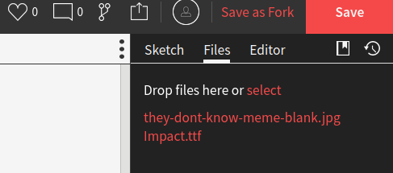
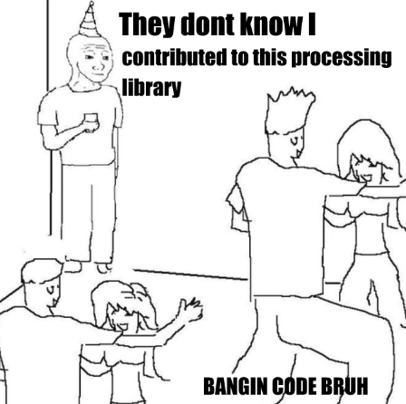

# Digital Migrations

[Full source files here](https://github.com/cheapjack/DigitalMigrations)

## Digital Art Toolkits


Almost all of computer science and what we know as digital culture follows a design principle of distributable packages that allow different humans (and non-humans like internet browsers, computer servers and operating systems) to do simple or complex things.

As we saw previously software engineers make useful **abstractions** - the functions and commands we can use to make our computers do things, often attached to buttons and screens to help **abstract away** the hard digital labour of data infrastructure of very complex data processing - of even simple digital images - while we normal humans get on with the very important work of digital art or shouting at people on the internet.

Everything digital depends on these packages - really little helpful toolkits - often labours of love and ranting by little known engineers and enthusiasts.

We're going to look at one toolkit - Processing -  one among many - that help non-software engineers do things with technology. Once you play with these toolkits you will start to recognise other kits and packages and begin to understand how to use them.

### Adventures in Processing


Processing is a programming environment developed specifically **for artists** to make interactive digital work online and for installations. It's incredibly powerful. We are going to look at the most recent developments in [p5.js](https://p5js.org) which is processing embedded in a contemporary web browser. Some very simple tags in an `.html` file links to the processing library so you can run processing sketches online easily. You'll need to use google chrome or Firefox to follow these resources; please do no use Microsoft Edge it does unexpected things we've not tested.

Using processing this way, you can display it on pretty much any browser and offers scope for mobile devices and cheap ways to build your installations on modest cheap platforms like [Raspberry Pi](https://www.raspberrypi.org/) rather than having to have a big energy hungry PC hidden behind the scenes.

You'll also learn the basics of programming with a language similar to javascript, which Processing is an easier abstraction of and languages like [Arduino](https://arduino.cc/) which you can use for physical computing with sensors. Most of the web is run on languages like javascript, so learning Processing and especially it's web friendly form of `p5.js` gives you plenty of transferable skills should you need them in the future.

Processing makes playing and sharing with other people really easy as we shall see by using the [OpenProcessing](http://openprocessing.org) website, where you can easily host and display your 'sketches' and more importantly hack, play and learn from ohter people's processing code.

# 1

## Getting Started

We'd like you to work through some of the `p5.js` [Learning Resources](https://p5js.org/learn/). Each of their tutorials explain the principles of the code and how the commands work with in-browser code windows you can play with. Don't forget, use Firefox or Chrome as a browser as these can handle it best. Once you've a feel for these basics, we've got a few exercises we'd like you to do making your own sketches in [OpenProcessing](http://openprocessing.org)

 * The basic [coordinate system](https://p5js.org/learn/coordinate-system-and-shapes.html) for drawing shapes in Processing.
 * Then look into [images](https://p5js.org/examples/image-load-and-display-image.html) and [text](https://p5js.org/examples/typography-words.html).


These are not essential for the first exercise but give you some extra literacy for doing our [2nd](#2) exercise, basic animation.

 * Controlling [Color](https://p5js.org/learn/color.html)
 * [Interactivity](https://p5js.org/learn/interactivity.html) How we can control things by keyboard presses and mouse/touch screen movements
 * [Program Flow](https://p5js.org/learn/program-flow.html) How we control the logic of the interactions


 You can look up everything else in the [Reference](https://p5js.org/reference/) section and play with [Examples](https://p5js.org/examples/).

After completing [1](#1) & [2](#2) we've provided information that will get you started publishing and displaying your work beyond the OpenProcessing platform, on your own domain/webspace, other platforms and your own computer.


# 1

### Gotta Make Memes

Adding text onto images is obviously a well used internet skill.

We'll be remaking a few memes in processing on the [OpenProcessing site](openprocessing.org/) which get's us using our coordinate knowledge while learning how to arrange typography, pre-loading files and other assets. First off get setup on [OpenProcessing](http://openprocessing.org) where we are going to work, make yourself an account and follow my [account](https://www.openprocessing.org/user/139972) and you'll be able to see our previous class work.

Have a look at our [example meme generator](https://www.openprocessing.org/sketch/986703) on OpenProcessing

First off paste the code below into a new open processing sketch

```

// Digital Migrations 2021 @cheapjack tutorial for making memes
// with p5.js to get the hang of loading in external assets and drawing text
// and images
// setup the variable memeFont


// setup the variable img & myFont to store our image and font
let img;
let myFont;

// make a function to pre-load it before your sketch runs
// memes often use Impact.ttf a true-type font
function preload() {
  img = loadImage('boromir.jpg');
  myFont = loadFont('Impact.ttf');
}

// setup as usual
function setup() {
	createCanvas(windowWidth, windowHeight);
	// make the canvas fit the meme img size
    // you use 'dot notation' which means you can access certain
    // predefined parameters to certain 'objects'
    // so you can also get the screen width of whatever device
    // you load the sketch on in a browser window  with
    // window.screen.width or window.screen.height
    createCanvas(img.width, img.height);
	background(0);
	image(img, 0, 0);
		stroke(0);
		strokeWeight(4);
    fill(255,255,255);
    textFont(myFont);
	textAlign(CENTER);
    textSize(36);
  // small point below is that in order to use an apostrophe you have to 'escape' the
	// apostrophe character so processing doesn't think it's the end
	// of a string, so convention is to surround the special character with a back slash
	text('ONE DOESN\'\T JUST', img.width/2, 50);
	text('DRAG DIGITAL IMAGES', img.width/2, img.height-60);
  text('INTO PROCESSING SKETCHES', img.width/2, img.height-20);
    }

function draw() {
	// uncomment the below to preview what we'll be moving onto next
    //ellipse(mouseX, mouseY, 20, 20);
    }

```
<br>


Then go to the 3 dots on the top right for more options, click the file tab and import the [boromir](https://github.com/cheapjack/DigitalMigrations/blob/master/docs/images/boromir.jpg) and [Impact.ttf](https://github.com/cheapjack/DigitalMigrations/blob/master/p5Tutorials/assets/Impact.ttf)


<br>

You'll see how the code 'pre-loads' the images and font files the sketch needs from the files stored in your file tab. Openprocessing gives you about 20MB of storage for free


### Random Memes

<br>

<br>

We made this [sketch to generate the above meme](https://www.openprocessing.org/sketch/1093262)


<br>

If you're still logged in on OpenProcessing you can choose to look at this and 'fork' the sketch clicking on the logo above on the right near where you clicked on the 3 dots to access the files tab. This way you can save it as one of your own and make your own version. Read through the sketch and all the comments and you'll see that we use a form of randomness to help us make meme generators that are different each time you load them.

Here's the code we used and again we upload the image and font file, with the same method clicking on the 3 dots logo to access the files tab and upload the documents we need to open processing.

Get the files you need below

 * [Blank Meme Image](https://github.com/cheapjack/DigitalMigrations/blob/master/p5Tutorials/hellomeme/images/they-dont-know-meme-blank.jpg)
 * [Impact.ttf our Custom font](https://github.com/cheapjack/DigitalMigrations/blob/master/p5Tutorials/assets/Impact.ttf)

```
// Digital Migrations 2021 @cheapjack tutorial for making memes
// with p5.js to get the hang of loading in external assets and drawing text
// and images
// setup the variable memeFont


// setup and 'declare' the variable img & myFont to store our image and font
let img;
let myFont;

// make a function to pre-load it before your sketch runs so its good to go
// memes often use Impact.ttf a true-type font
function preload() {
	// loadImage called 'they-dont-know-meme-blank.jpg' which is in the same directory as this sketch
	// into the variable we 'declared' earlier, img
  img = loadImage('they-dont-know-meme-blank.jpg');
	//do the same to preload a font
  myFont = loadFont('Impact.ttf');
}

// setup as usual
function setup() {
	createCanvas(windowWidth, windowHeight);
	// make the canvas fit the meme img size
    // you use 'dot notation' which means you can access certain
    // predefined parameters to certain 'objects'
    // so you can also get the screen width of whatever device
    // you load the sketch on in a browser window  with
    // window.screen.width or window.screen.height
    createCanvas(img.width, img.height);
	background(0);
	image(img, 0, 0);
	// Make a simple random text generator by making an array of phrases and text
	// Then uncomment (remove the leading //) lines 56, 58 & 60 and commenting out 55, 57 & 59 (add 2 // at the start to make text go grey)
	// Remember our arrays in the first session? Instead of an array of coordinates we can make
	// an array of text 'strings' Like many languages, Processing calls a sequence of text a text string,
	// ie a string of alphanumeric chararters enclosed in single of double quotes
	// Refer to our DIY dataset and notice the similarity and how many kinds of variable
	// https://cheapjack.github.io/DigitalMigrations/Data_As_Art_Material.html#diy-dataset-
	myMemeText1 = ['contributed to this processing', 'lost my job at the', 'hate everyone'];
	myMemeText2 = ['library',' ','computers'];
	partyText = ['BANGIN!', 'THIS SUCKS', 'WOOOAHHHHHH!'];

		//stroke(0);
		//strokeWeight(4);
    fill(0,0,0);
    textFont(myFont);
	textAlign(LEFT);
    textSize(48);
  // small point below is that in order to use an apostrophe you have to 'escape' the
	// apostrophe character so processing doesn't think it's the end
	// of a string, so convention is to surround the special character with a back slash
	text('They dont know I ', img.width/4 + 30, 60);
	textSize(36);
	text('contributed to this processing', img.width/4+35, 110);
	//text(random(myMemeText1), img.width/4+35, 110); // Here instead of typing the text, myMemeText1 is randomly chosen when the sketch runs
	text('library', img.width/4+35, 160);
	//text(random(myMemeText2), img.width/4+35, 160);
	text('BANGIN CODE BRUH', img.width/2, img.height-20);
	//text(random(partyText), img.width/2, img.height-20);
    }

function draw() {
	// uncomment the below to allow people to graffitti the sketch
    //ellipse(mouseX, mouseY, 20, 20);
    }
```

# 2
## Throw Some Shapes

You should now be familiar with some basics which we'll now pull together in a new sketch on OpenProcessing.


We are going to follow the [Basic shape drawing](https://p5js.org/learn/coordinate-system-and-shapes.html) tutorials by reading along and pasting into an openprocessing sketch.

I've also combined it into a [sketch file called robotmover.js on openprocessing here](https://www.openprocessing.org/sketch/771430)

The code is below

```
// OK the first line of this code is "//" which processing or javascript ignores
// So you can write comments. We saw this in earlier classes. It's a useful
// convention so that when you or others return to the code they'll
// understand what you were trying to do!
// for longer commments with multiple lines you can
/* use this
and it will comment
out
all the lines following until you end it with
*/
// now you'll see the code below light back up.
// All processing sketches call a setup() and draw() function
// A function is an object that when you 'call' it it runs the code in it's curly brackets
//
// Setup a useful value for later
let x = 0;

function setup(){
    createCanvas(100, 100);
    rectMode(CENTER);
    //noLoop();
    //rectMode(CORNERS);
}

function draw(){
    point(40, 50); // point(x, y)
    //line(10, 20, 50, 20); // line(x1, y1, x2, y2)
    //rect(10, 20, 40, 30); // rect(x, y, width, height)
    //ellipse(30, 30, 40, 60); // ellipse(x, y, width, height)
    //background(200);
    //robot(x,100);
    //x++;
}

// Robot Drawing function
// Don't forget to increase the canvas size

function robot(pos_x,pos_y){
    rect(pos_x,pos_y,20,100);
    ellipse(pos_x,pos_y-30,60,60);
    ellipse(pos_x - 19,pos_y-30,16,32);
    ellipse(pos_x+19,pos_y-30,16,32);
    line(pos_x-10,pos_y+50,pos_x-20,pos_y+60);
    line(pos_x+10,pos_y+50,pos_x+20,pos_y+60);
    }

    /*
    function mousePressed() {
          loop();
    }
    function mouseReleased() {
          noLoop();
    }
    */

```


## Advanced Processing

Looking for some more advanced stuff like amazing generative physics? Daniel Schiffman (creator of Processing) has an amazing book that walks you through really advanced stuff to make work that actually feels alive and is a great creative introduction to programming. [The Nature of Code](https://natureofcode.com/book) is made for the Processing stand alone Application/Programme but he has 'ported' ie translated all of the code for p5.js so it works in OpenProcessing. [p5js Version of Nature Of Code Examples](https://github.com/nature-of-code/noc-examples-p5.js)

I made a simple example drawing tool for [Cerys](https://www.openprocessing.org/sketch/835864). Run it and draw with the mouse or touch screen or imagine drawing on top of the screen with tracing paper, how will your drawing be affected by the randomness?


# Publishing


The following section is not essential for this year, but many of you may well find it useful if you really get into processing and have to present it professionally. At some point we'll need to show our sketches through exhibitions in the real world if you can remember those or on the internet. It's super easy to just point people to your OpenProcessing sketches and if you share the address they'll be able to play with it and see the code etc even on their phones.

But at some point you'll need to display your sketches in the 'real' world we've all heard about, on servers of your own or as part of other webpages out on the wild world web.

Look at [Getting Started](https://p5js.org/get-started/) you'll see how easy it is to embed your code in an `.html` file and display it locally - on your own computer - or on a publicly accessible server you have control of and know it's address.

## DIY

Obviously we'd like you to be able to be as independent as possible to make a difference out in the digital world.

Try pressing `ctrl` & `U` in any webpage and you will be able to view the `.html` source files for whatever page your looking at.

`html` is another markup language like we used in Processing and OpenSCAD but here it's for parsing and displaying the web. Most webpages now use your web browser like an operating system and do impressive stuff like machine learning or 3D graphics.

But like with our handcrafted bitmaps we can also make super basic webpages. Open a `.txt` file and paste the following into it but save it so the file ending is `.html` instead of `.txt` `helloworld.html`. Then open the file with your web browser.

```
<!DOCTYPE html>
<!-- This is a comment in html -->
<html lang="en">
  <head>
    <meta charset="utf-8">
    <title>An Artist's First Website</title>
  </head>
  <h1>Hello Here is Some Art</h1>
  
  <!-- or replace with a local file on your computer
  -->
</html>
```

Try making it and replace the image with one the image you generate in processing.

However what we really want to do is to display our complete processing sketches online preferably for free but with a bit more freedom and glitch is a good place to do that. Also it's like processing in that it has a vast community of people using it but unlike processing they are using every language out there online, not just processing.

## Glich.com

Sign up to glitch and you'll be able to view our meme and robot sketches hosted on glitch. One note is that ISS on campus may not allow access to glitch as temporarily the glitch DNS servers had an issue that was resolved recently but bear in mind if this is an issue.

Here we have our sketches hosted on glitch

 * [Meme Sketch](https://quartz-memery.glitch.me)
 * [Robot Sketch](https://uncovered-sesame.glitch.me)

Have a look at the code in the links below and you'll see how the sketch and html file need to be structured. Pay attention to the need for uploading files into the assets folder (click on it to do that) and then make sure you use the special file paths needed for glitch when you're importing images and fonts in the meme sketch.

 * [Meme Sketch Source Code](https://glitch.com/edit/#!/quartz-memery)
 * [Robot Sketch Source Code](https://glitch.com/edit/#!/uncovered-sesame)

All you need is an `.html` file with a link to the processing libraries, a `sketch.js` javascript file; other resources like snazzy css etc can be added later; and any browser can run your code.

Theres more info in [Get Started](https://p5js.org/get-started/) for using p5.js online and locally.

To run different sketches just make new `new_sketch.js` files with different names and make the `.html` file load the new sketch javascript file. You can easily run all kinds of things with glitch even personal websites or mobile apps.


## Further Adventures in HTML

If you want to get heavily into html, the best place to start is the Mozilla foundation who make the best tutorials out there. Start with their [Getting Started with the Web Tutorial](https://developer.mozilla.org/en-US/docs/Learn/Getting_started_with_the_web)

It can still be quite daunting and a pain to setup and control your own server space and domain name to store and display your work. The [Digital Ocean Platform](https://www.digitalocean.com/community/tutorials/how-to-set-up-your-html-website-project) is a good all rounder but it can be a steep learning curve; but fortunately they have alot of community documentation to help.

Alternatively there are even easier web services out there if you just search for "Easy domain hosting" or something


## Code is Data, Data is Code


## Store your code in a QRCode

This is an advanced addition to how to publish code, quite a bizarre approach that we've included to make the point that data and code can take many forms so here's a method of distributing small sketches using the [itty.bitty.site service](https://itty.bitty.site/#About) where your code is stored ***in the url address of the webpage***. We don't advise making this the way you distribute your code or your work, as who knows how long the **itty.bitty** toolkit will be maintained but again it's an interesting technical experience to try.

Your html and javascript processing code is *stored in it's* ***own*** *web address*. So it's got a crazy long web address which encodes the `.html` webpage data. But here's the weird thing; It is not just showing you the address where your code lives, rather the ***address itself STORES the 1s & 0s of your code***. In [Marshall McLuhen's terms](https://en.wikipedia.org/wiki/Marshall_McLuhan) The medium is ***literally*** the message! Have a look at the size of the address; a huge string of characters you could never remember. The itty bitty service basically encodes your `html` file into that string of numbers so when you visit it some clever javascript decodes it and parse the `.html`


Which sounds weird but it illustrates how in the ontology of computer science anything can be parseable data; code can encode and decode itself. makes it like a super secret location for your work, but accessible via social media or a <a href="https://zxing.org/w/chart?cht=qr&chs=548x548&chld=L|1&choe=UTF-8&chl=https%3A%2F%2Fitty.bitty.site%2F%23p5inaurl%2Fdata%3Atext%2Fhtml%3Bcharset%3Dutf-8%3Bbxze64%2CXQAAAAIFAgAAAAAAAAAeGgqG70rWheVKb4%2FZd2JBotXX2pGt61wvtVVRs3%2BwWfKtQtPC5BWBMWmTV96zOk3Tl2Z7Ri3hKCR2v6Ic5sAYDcNkhttwHABEtVYtx1pJ%2BylJOpKzrjNbpOLesvC8zvr5rnxWVAVRzH2ioAAf%2B7XhohXlSd7sYwKFLptanYVdS7P946FBpft8OLTJMxa1foY0l%2F%2FGKWxTpjp60mRl1dbIOsERP4iVe7ZrnULF86BaF8LEePOdGyUELpcMi6J028ZGAV0kN1q%2FyKyiUtEPTjbyWT2aCT%2F23Yh6BTRLtL%2F6aNxWytrTzLOAihbnFiGv9wJq6ipTsz6vWMapOgCKGBTQIVKrCzjoCPHnqBsZZvkQMsF8B0DYuxq7Og0x%2FsOSn%2FTYRyfyWClc9PftyP%2BufoYA">QR Code</a> which you can print out (or draw) and readable from any smartphone.


Get your phone out, click on the address above, open up a QRCode reader, point it at your screen and it will take you to [this address](https://itty.bitty.site/#p5inaurl/data:text/html;charset=utf-8;bxze64,XQAAAAIFAgAAAAAAAAAeGgqG70rWheVKb4/Zd2JBotXX2pGt61wvtVVRs3+wWfKtQtPC5BWBMWmTV96zOk3Tl2Z7Ri3hKCR2v6Ic5sAYDcNkhttwHABEtVYtx1pJ+ylJOpKzrjNbpOLesvC8zvr5rnxWVAVRzH2ioAAf+7XhohXlSd7sYwKFLptanYVdS7P946FBpft8OLTJMxa1foY0l//GKWxTpjp60mRl1dbIOsERP4iVe7ZrnULF86BaF8LEePOdGyUELpcMi6J028ZGAV0kN1q/yKyiUtEPTjbyWT2aCT/23Yh6BTRLtL/6aNxWytrTzLOAihbnFiGv9wJq6ipTsz6vWMapOgCKGBTQIVKrCzjoCPHnqBsZZvkQMsF8B0DYuxq7Og0x/sOSn/TYRyfyWClc9PftyP+ufoYA)

If you read the url address in your browser you can see how big the address is to encode all the bytes of your file.

```
https://itty.bitty.site/#p5inaurl/data:text/html;charset=utf-8;bxze64,XQAAAAIFAgAAAAAAAAAeGgqG70rWheVKb4/Zd2JBotXX2pGt61wvtVVRs3+wWfKtQtPC5BWBMWmTV96zOk3Tl2Z7Ri3hKCR2v6Ic5sAYDcNkhttwHABEtVYtx1pJ+ylJOpKzrjNbpOLesvC8zvr5rnxWVAVRzH2ioAAf+7XhohXlSd7sYwKFLptanYVdS7P946FBpft8OLTJMxa1foY0l//GKWxTpjp60mRl1dbIOsERP4iVe7ZrnULF86BaF8LEePOdGyUELpcMi6J028ZGAV0kN1q/yKyiUtEPTjbyWT2aCT/23Yh6BTRLtL/6aNxWytrTzLOAihbnFiGv9wJq6ipTsz6vWMapOgCKGBTQIVKrCzjoCPHnqBsZZvkQMsF8B0DYuxq7Og0x/sOSn/TYRyfyWClc9PftyP+ufoYA
```

I simply dragged the `.html` file below from the desktop into the [itty.bitty.site](https://itty.bitty.site/) window

```
<html>
  <head>
    <!--This is the link to load up the Processing P5 library-->
    <script src="https://cdnjs.cloudflare.com/ajax/libs/p5.js/0.9.0/p5.js"></script>
    <script>
    <!--Here's our processing code. Because we've loaded the p5 library-->
    <!--above the webpage knows what to do with it-->
        function setup() {
        createCanvas(window.screen.width, window.screen.height);
        noStroke();
        }

        function draw() {
        let x = mouseX;
        let y = mouseY;
        let ix = width - mouseX;  // Inverse X
        let iy = height - mouseY; // Inverse Y
        background(126);
        fill(255, 150);
        ellipse(x, height/2, y, y);
        fill(0, 159);
        ellipse(ix, height/2, iy, iy);
        }
     </script>
     </head>
    <body>
    </body>
</html>
<!--Thats it -->
```

#### Tip

Normally you would link to a `sketch.js` file in the same folder as the html which is good practice, but we've bundled it in the page for this server-less example

#### Screen Size

Notice that in line 9 instead of defining the canvas as `createCanvas(200, 200);` we can use the [Screen.width](https://developer.mozilla.org/en-US/docs/Web/API/Screen/width) object from the `HTML5` web API so instead we use

```
createCanvas(window.screen.width, window.screen.height);
```

With this method you get the sketch canvas to fill *any* screen on *any* device. So imagine a crowd of people and their phones can become a crowd source data canvas...

#### More Info

Here's the tutorial on [server less webpages](https://hackaday.com/2018/07/07/tiny-websites-have-no-server/) which explains in more detail. You need the [itty.bitty.site server](https://itty.bitty.site/#About) for it to work but all the code is [open source](https://github.com/alcor/itty-bitty) so you could host it yourself if you wanted to. Here's an older similary one [Server less websites for hacky tech art](https://hackaday.com/2017/05/13/javascript-art-is-in-the-url/)
featuring the artist [Alexander Reben](https://areben.com/) AKA [artBoffin](https://github.com/artBoffin) on github and his [https://www.4qr.xyz](https://www.4qr.xyz/about/) project


## Is Sharing Caring?

The [a2p](a2p.bitmark.com) project is an interesting take on storing digital work; it's basically a project trading artworks amongst artists using blockchain technology provided by a company called [Bitmark](https://bitmark.com/en/). Blockchain is a form of public ledger; like a shared accountancy spreadsheet, where everyone on the internet can see a record of transactions, and with some clever cryptography these records can never be falsified.

We could use the itty.bitty server to share work. It's not secure but thos addresses are so impractical it's like visiting a very obscure print collection nobody knows about.


When we use code, pigments and other sculptural materials we become intimately involved with something that has vast human histories; think of the complex colonial [histories of pigments and dyes](https://99percentinvisible.org/episode/the-secret-lives-of-color/) or the disturbing story of [Johann Bottger](https://en.wikipedia.org/wiki/Johann_Friedrich_B%C3%B6ttger) in the race to copy the innovations of China nearly 2000 years ago. Programmers often talk about *'standing on the shoulders of giants'* referring to the years of creative work and effort to develop the <a href="https://en.wikipedia.org/wiki/Stack_(abstract_data_type)">stacks</a> of computer science funded initially by US military imperialism and [corporate lobbying](https://www.thenation.com/article/silicon-valley-history-book-review/), that make the internet work.

When we think of creating artworks like this, in terms of materialism or in just the day to day practice of making things happen with pixels, does it problematise the idea of ownership? The cultural, social and economic capital of digital artworks are hard to trace, often obscuring years of invisible work, the real labor time of data. It makes you think exactly what it is you share, when you make digital work.

# More artists who code

You might like [Matt DesLauriers AKA @mattdesl](https://twitter.com/mattdesl) work which we will look at later and he's really active on [Glitch](https://glitch.com/). We'll be visiting his workshops next time

🗒️  [Course Notes](https://github.com/mattdesl/workshop-p5-intro)

🎨  [p5.js Demos](https://p5-demos.glitch.me)

🔊  [Tone.js Demos](https://tone-demos.glitch.me)
