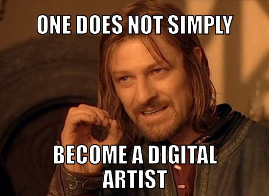

# Digital Migrations

## Year 2 Class 3




# 1

### Adventures in Processing


Processing can be downloaded and used to develop projects on your own computer but we are going to look at the most recent developments in p5.js which is processing for the contemporary browser. It means you can display it on any browser and offers scope for mobile devices while also cheap ways to build installations on more modest platforms like Raspberry Pi rather than having to have a big energy hungry PC hidden behind the scenes.

I like it because learning processing this way you also learn javascript which most of the web is run on so plenty of transferable skills.

It also makes playing and sharing with other people really easy as we shall see by using [openprocessing](http://openprocessing.org) to hack and play with processing code

## Getting Started

We'll be working through the [Getting Started Tutorial]( you can look up everything in the [Reference](https://p5js.org/reference/)
and play with [Examples](https://p5js.org/examples/)

### Throw Some Shapes

[Basic shape drawing](https://p5js.org/learn/coordinate-system-and-shapes.html) and [Color](https://p5js.org/learn/color.html)

### Mandem/Gyaldem Gonna Make Memes

Adding text onto images

### Webcam Fun

Use webcams to generate video effects?


# 2

### Interactivity


We are working our way through [the p5 Interactvity Page](https://p5js.org/learn/interactivity.html)

# 3

## Publishing


One of the easiest ways to leave openprocessing is to host project files on a computer or server on the internet. All you need is an `.html` file with a link to the processing libraries, a `sketch.js` javascript file; other resources like snazzy css etc can be added later; and any browser can run your code. You could do this in any text editor or use [Thimble](https://thimble.mozilla.org/en-US/) or after December 2019 it's successor [glitch](https://glitch.com) or other things like [CodePen](https://codepen.io/pen/). 

You can see this working locally, (ie on your computer) by downloading or `git clone`'ing  this repo, onto your computer and opening [index.html](index.html) and this minimal webpage will load the processing library, and run your code. 

To run different sketches just make new `.js` files with different names and make the `.html` file load the new sketch javascript file.

Now download the [DigitalMigrations repository](https://github.com/cheapjack/DigitalMigrations) to somewhere on your workspace, it will appear as a directory called `DigitalMigrations-master`.

Now delete the existing `index.html` and `style.css` files in the Thimble window and drag in the files from the `adventuresintext` folder (not the folder itself). Only Chrome will let you do that; please dont use the default Windows Edge browser it's horrible. If for some reason it wont let you drag and drop try to cut and paste the text from the `index.html` & `main.js` files from the repo online into new files called `index.html`, `style.css` and `main.js`. You also need a folder of images called `images`  

These files are well commented and we'll walk through them together.


# 4

## Code is Data, Data is Code


We are working toward a hybrid workshop where we make work together so we'll need to show our processing sketches to the world. So it's super easy to just point people to your open processing sketch and if they have the address they'll be able to play with it and see the code etc.

But what about displaying our sketches in the 'real' world on servers of your own out on the wild world web? If you look at [Getting Started](https://p5js.org/get-started/) you'll see how easy it is to embed your code in an `.html` file and display it locally or on a server you have control of and know it's address.

But what if you dont want to have to setup a server, fiddle with dns settings from a web provider? What if you just want a permanent web page at a specific address to show a bunch of simple experiments?

Well here's a method of distributing small sketches using [itty.bitty.site service](https://itty.bitty.site/#About) where your code is stored ***in the url address of the webpage***. Your html and javascript processing code is *stored in it's* ***own*** *web address*. So it's got a crazy long web address which enocodes the `.html` webpage data. Have a look at the size of the address; a huge string of characters you could never remember. The itty bitty service basically encodes your `html` file into that string of numbers so when you visit it some clever javascript decodes it and parse the `.html`


Which sounds weird but it illustrates how in the ontology of computer science anything can be parseable data; code can encode and decode itself. makes it like a super secret location for your work, but accessible via social media or a <a href="https://zxing.org/w/chart?cht=qr&chs=548x548&chld=L|1&choe=UTF-8&chl=https%3A%2F%2Fitty.bitty.site%2F%23p5inaurl%2Fdata%3Atext%2Fhtml%3Bcharset%3Dutf-8%3Bbxze64%2CXQAAAAIFAgAAAAAAAAAeGgqG70rWheVKb4%2FZd2JBotXX2pGt61wvtVVRs3%2BwWfKtQtPC5BWBMWmTV96zOk3Tl2Z7Ri3hKCR2v6Ic5sAYDcNkhttwHABEtVYtx1pJ%2BylJOpKzrjNbpOLesvC8zvr5rnxWVAVRzH2ioAAf%2B7XhohXlSd7sYwKFLptanYVdS7P946FBpft8OLTJMxa1foY0l%2F%2FGKWxTpjp60mRl1dbIOsERP4iVe7ZrnULF86BaF8LEePOdGyUELpcMi6J028ZGAV0kN1q%2FyKyiUtEPTjbyWT2aCT%2F23Yh6BTRLtL%2F6aNxWytrTzLOAihbnFiGv9wJq6ipTsz6vWMapOgCKGBTQIVKrCzjoCPHnqBsZZvkQMsF8B0DYuxq7Og0x%2FsOSn%2FTYRyfyWClc9PftyP%2BufoYA">QR Code</a> which you can print out (or draw) and readable from any smartphone.

Get your phone out, click on the address above, open up a QRCode reader, point it at your screen and it will take you to [this address](https://itty.bitty.site/#p5inaurl/data:text/html;charset=utf-8;bxze64,XQAAAAIFAgAAAAAAAAAeGgqG70rWheVKb4/Zd2JBotXX2pGt61wvtVVRs3+wWfKtQtPC5BWBMWmTV96zOk3Tl2Z7Ri3hKCR2v6Ic5sAYDcNkhttwHABEtVYtx1pJ+ylJOpKzrjNbpOLesvC8zvr5rnxWVAVRzH2ioAAf+7XhohXlSd7sYwKFLptanYVdS7P946FBpft8OLTJMxa1foY0l//GKWxTpjp60mRl1dbIOsERP4iVe7ZrnULF86BaF8LEePOdGyUELpcMi6J028ZGAV0kN1q/yKyiUtEPTjbyWT2aCT/23Yh6BTRLtL/6aNxWytrTzLOAihbnFiGv9wJq6ipTsz6vWMapOgCKGBTQIVKrCzjoCPHnqBsZZvkQMsF8B0DYuxq7Og0x/sOSn/TYRyfyWClc9PftyP+ufoYA)

If you read the url address in your browser you can see how big the address is to encode all the bytes of your file.

```
https://itty.bitty.site/#p5inaurl/data:text/html;charset=utf-8;bxze64,XQAAAAIFAgAAAAAAAAAeGgqG70rWheVKb4/Zd2JBotXX2pGt61wvtVVRs3+wWfKtQtPC5BWBMWmTV96zOk3Tl2Z7Ri3hKCR2v6Ic5sAYDcNkhttwHABEtVYtx1pJ+ylJOpKzrjNbpOLesvC8zvr5rnxWVAVRzH2ioAAf+7XhohXlSd7sYwKFLptanYVdS7P946FBpft8OLTJMxa1foY0l//GKWxTpjp60mRl1dbIOsERP4iVe7ZrnULF86BaF8LEePOdGyUELpcMi6J028ZGAV0kN1q/yKyiUtEPTjbyWT2aCT/23Yh6BTRLtL/6aNxWytrTzLOAihbnFiGv9wJq6ipTsz6vWMapOgCKGBTQIVKrCzjoCPHnqBsZZvkQMsF8B0DYuxq7Og0x/sOSn/TYRyfyWClc9PftyP+ufoYA
```

I simply dragged the `.html` file below from the desktop into the [itty.bitty.site](https://itty.bitty.site/) window

```
<html>
  <head>
    <!--This is the link to load up the Processing P5 library-->
    <script src="https://cdnjs.cloudflare.com/ajax/libs/p5.js/0.9.0/p5.js"></script>
    <script>
    <!--Here's our processing code. Because we've loaded the p5 library-->
    <!--above the webpage knows what to do with it-->
        function setup() {
        createCanvas(window.screen.width, window.screen.height);
        noStroke();
        }

        function draw() {
        let x = mouseX;
        let y = mouseY;
        let ix = width - mouseX;  // Inverse X
        let iy = height - mouseY; // Inverse Y
        background(126);
        fill(255, 150);
        ellipse(x, height/2, y, y);
        fill(0, 159);
        ellipse(ix, height/2, iy, iy);
        }
     </script>
     </head>
    <body>
    </body>
</html>
<!--Thats it -->
```

#### Tip

Normally you would link to a `sketch.js` file in the same folder as the html which is good practice, but we've bundled it in the page for this server-less example

#### Screen Size

Notice that in line 9 instead of defining the canvas as `createCanvas(200, 200);` we can use the [Screen.width](https://developer.mozilla.org/en-US/docs/Web/API/Screen/width) object from the `HTML5` web API so instead we use

```
createCanvas(window.screen.width, window.screen.height);
```

With this method you get the sketch canvas to fill *any* screen on *any* device. So imagine a crowd of people and their phones can become a crowd source data canvas...

#### More Info

Here's the tutorial on [server less webpages](https://hackaday.com/2018/07/07/tiny-websites-have-no-server/) which explains in more detail. You need the [itty.bitty.site server](https://itty.bitty.site/#About) for it to work but all the code is [open source](https://github.com/alcor/itty-bitty) so you could host it yourself if you wanted to. Here's an older similary one [Server less websites for hacky tech art](https://hackaday.com/2017/05/13/javascript-art-is-in-the-url/)
featuring the artist [Alexander Reben](https://areben.com/) AKA [artBoffin](https://github.com/artBoffin) on github and his [https://www.4qr.xyz](https://www.4qr.xyz/about/) project


