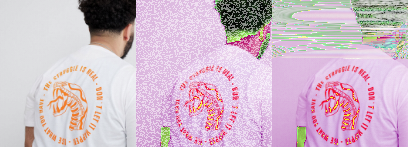

# Digital Migrations

## Digital Skills workshops at LICA

A series of workshop materials and links to extend simple digital skills into an *approach to data* for developing art practices at LICA. Rather than teach digital tools we might know about or can buy and learn elsewhere like Photoshop, our approach is an easy introduction by doing to the idea of manipulating 'data' or information for creative ends. 

You can link to the walk throughs below to begin depending on your year group and class

 * [Year 1 Class 1](Year1_Class1.md)
 * [Year 1 Class 2](Year1_Class2.md)
 * [Year 2 Class 1](Year2_Class1.md)
 * [Year 2 Class 2](Year2_Class2.md)
 * [Year 2 Class 3](Year2_Class3.md)
 * [Year 2 Class 4](Year2_Class4.md)

More on [why I think we should think about data below](#why-data) but below is an overview of what we are doing across all year groups.

### Image Glitching

We are going to use in-browser tools made by the excellent multimedia designer/technologist [Georg AKA 'Snorpey'](https://fishnation.de/) that let you [manipulate images](http://snorpey.github.io/experiments/) including links to all the javascript code that made them, shared on the popular code sharing platform, github.

### 3D object making in the browser

[OpenSCAD](http://www.openscad.org/) is a tool for making 3D and 2D shapes with data and code. Like many things, there's now a version that runs in a webpage. So we are going to use OpenJSCAD (javascript implementation of OpenSCAD) in the browser and lets you save `.stl` files, the 3d printing standard

### DIY dataset

Data does not have to be big. We'll experiment generating data via observation and drawing.

### Adventures in Text

Thinking of data as a practice means you can make present and manipulate text and images in interactive ways. Basic `HTML` and `JavaScript` and basic coding

### Databending Images into Sound and back

Make images, sound, play with the sound and turn back to images.

Follow my [Instructions](AudioBending.md) simplified from this Introduction to [Databending images with sound software](http://www.hellocatfood.com/databending-using-audacity/)

Using [Audacity](https://www.audacityteam.org/download/)

### Why Data

Usually all the data stuff when we make digital images or video happens behind the scenes so you never think about it and for good reason; if you want to manipulate images in creative ways you often just want instant results. Then you can get on with the important stuff of making work.

Computer scientists have abstracted all the data stuff away so you can use it as a tool which is all good. However, thinking on a simple level of how a digital image is made up of individual 'pixels' with numbers assigned to it has it's advantages. When images are turned into a list of numbers; into data with a very specific schema or format, they can be 'translated' and manipulated in powerful ways. Just thinking of an image like this gives you access to a literacy in what your tools are actually doing which could lead to you making your own tools or using your existing ones in new ways. And literacy can lead to the intuition and development we often need in our art practices. 

In many ways a digital image is not an image at all but more like an abstract 'spatial' map of related coordinates and numbers in a colour space that use a format or schema that other people and machines know about so they can be shared on phones, projectors, monitors, or inkjet printers.

So our image data 'maps', can be read into other formats just as someone drawing will map visual experience to marks on paper; images can be turned into sound, manipulated as if they were so and translated back into images. 

You can also make up data that's not referring to sound or colour but perhaps record experiences or find data online.

This is a series of exercises to show that doing that is not that difficult.

### Further Tools

A good place for artists interested in code, data and this kind of practice is [Processing](http://processing.org). Initially check out Dan Shiffman's (Processing inventor) [Highly Enthusiastic video](http://hello.p5js.org/). 

Then browse the work of a huge community of artists and creatives on the [Open Processing](https://www.openprocessing.org/) site which lets you get coding straight away in the browser without downloading anything. You can then move onto downloading to your own computer. 

We cover some Processing basics using a really exciting development of Processing running in your internet browser and `html` documents with [p5.js](p5js.org) which makes it really close to javascript as it shares many methods and objects so good for transferrable web skills. Check out classes 3 & 4 for that!

Then if you want to make physical sensors to generate data it's worth checking out artist [Laura Pullig's](https://tactile-electronics.tumblr.com/) workshop tutorial called [What Does Health Look Like](https://github.com/DoESLiverpool/what-does-health-look-like) using Processing and the [BBC Microbit](https://microbit.org/) a £15 computer system for learning Physical computing. 

#### 3D design tools toward 3D printing and fabrication
 * [OpenSCAD](http://www.openscad.org/)
 * Or for a more simple design environment setup a free account for [TinkerCAD](https://www.tinkercad.com/)

## Artists who use Data

### Glitchers

Rosa Menkman "vernacular of file formats" 

Nick Briz "glitch codec tutorial" [video](https://www.youtube.com/watch?v=hOemlx2sBIo)

Takeshi Murata ["pink dot"](https://www.youtube.com/watch?v=eZkY6zFbwgQ)

Phillip Sterns ["glitch textiles"](https://www.glitchtextiles.com/)

#### Data Textiles and Painting

[Dan Hays](http://danhays.org/coloradosnow3.html) work hand takes the abstracted cartesian 'image maps' back to their material artefacts through hand painting pixels. Ironic that programmers spend years on the data architecture of images for convenience only for the image makers to un-convenience it almost in protest.

[Sam Meech](http://smeech.co.uk) makes very interesting takes on very simple digital images and translates them with knitting machines, video, performance and interaction

#### Data Art & Activism

[James Bridle](http://jamesbridle.com/works) is a journalist and artist uncovering the infrastructure of our now ubiquitous data culture.

[Forensic Architecture](https://www.forensic-architecture.org/) famously won the 2018 Turner Prize and challenge what artists (or architects) are meant to do at all

[Julian Oliver](https://julianoliver.com/output/) started out doing high end yet philosophically straightforward media-interaction work like [Fijuu](https://www.fact.co.uk/projects/dingdong/julian-oliver-pix-fijuu) which I invited him to show in FACT in Liverpool back in 2008: he just kindly sent me the software and a hardware spec and I set it up in the gallery. He went on to develop the [Critical Engineering Manifesto](https://criticalengineering.org/) and [making
work and projects](https://julianoliver.com/output/) on the edge of speculative design and tools for network activism. He now makes doomy (and rightly so) tweets about climate change and offers his coding skills for free to build secure comms for climate activists. Using data means you can make political engaging work that may actually help things change for the better. 

Directory of data artists [Big Bang Data Project at Somerset House](http://bigbangdata.somersethouse.org.uk/artists/)

[Lucy Kimbell](http://www.lucykimbell.com/LucyKimbell/Projects.html) Artist and researcher, writer and strategic design in social innovation. Considering and participating in wider data cultures can help sustain an artistic practice.

[Ellie Harrison](https://www.ellieharrison.com/), a self confessed recovering data addict who has been recording how much she swims every day for years until she swims the atlantic. Also famously connected a vending machine to austerity data, campaigns to [Bring Back British Rail](https://www.bringbackbritishrail.org/) and got roasted by the Daily Record for an Arts Council Funded Project for her to only work within the Greater Glasgow Strathclyde region to reduce her carbon footprint. 

[Sam Thulin](http://www.lancaster.ac.uk/cemore/author/sthulin/) does a [Data Sensor Drone-By](http://www.lancaster.ac.uk/cemore/drone-over-data-centre/)
