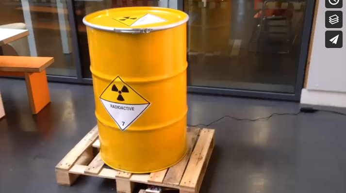

## Code Help

Useful code and pointers for digitally migrating visual artists at LICA

<h1>🔊🔌📹☢️</h1>

Ardunio code for #pinging an SRF05 ultrasonic distance sensor to trigger mp3 files on an @adafruit [music-maker shield](https://www.adafruit.com/product/1788) for Steve Wallis' Nuclear Waste Drum installation

