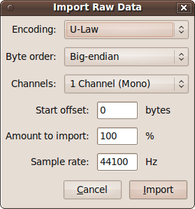
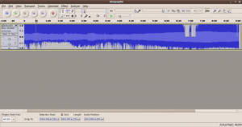
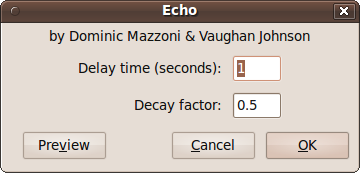
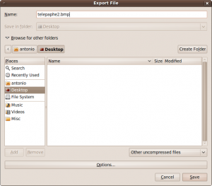
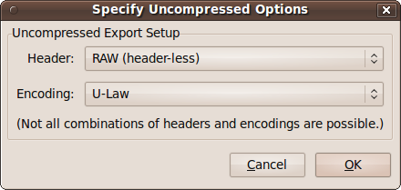

## Audiobending Images
### Hack images by turning their raw data into sound, adding special effects.

 * Convert your image into an uncompressed image format, such as `.bmp` or `.tiff`. As `.jpgs` and other popular formats are *compressed* data there’s more chance of completely breaking the image format, rather than 'hacking' it. 
  * Tools to convert: [GIMP](https://www.gimp.org/) or [Imagemagick](https://imagemagick.org/script/index.php) or your faviourite image editor and convert it to an uncompressed format like `.bmp`.

 * Download [Audacity](https://www.audacityteam.org/download/). You don’t need the lame plugin as we wont be exporting to mp3, though grab it if you plan to use it for that feature in the future. 
 
 * Open **Audacity** and select `File > Import > Raw Data` and select your uncompressed `.bmp` file. What you’ll now be presented is with options on how to import this *raw data*

 * Under Encoding you’ll need to select either U-Law or A-Law (remember which one you choose). When you choose any other format you’ll be converting the data into that format. Whilst you want to achieve data modification this is bad because it’ll convert the header of the image file, thereby 'breaking' the image format. U/A-Law just imports the data without adding a header based on another format. When you’re ready press Import and you’ll see your image as audio data, with time on the `x` axis (Left to Right) and amplitude, which effectively means volume, on the `y` axis (up & down).

 * Press play and it’ll probably sound like structured white noise or experimental electronic sound. 
 * Select everything from about five seconds into the audio. This is to avoid the header we talked about at the beginning or 'head' of the file. Unless you know the size of the header and exactly where it ends, you can usually guess that it’s a second or so into the audio. The best way to find it out is to try it out!

 * Highlight the section after the header and select `Effect > Echo`.
Leave the default settings as they are and press OK

 * You’ll see that your audio has changed visually. It still wont sound any better. 

 * Once you’re happy with your modifications select `File > Export`.   Choose a new location for your image and type in the proposed new file name but don’t press save just yet. Choose a sensible name like `NameOfMyOriginalFileEcho.bmp`. Next you’ll need to change the export settings to match the import settings.

 * Change the file format to `Other Uncompressed Files` and then click on the `Options` button.

 * Change the settings to match the ones above (or to A-Law if you imported as A-Law). Now Save. If you entered a file extension when you were choosing a file name you’ll get a warning about the file extension being incorrect, but you can ignore it and continue. If you didn’t choose a file extension, when the file is finished exporting, add the appropriate extension to the file. In our case I’ll be adding `.bmp` to the end.

 * Open the new file in your image editor and checkout the results!

 * Try applying different audacity effects on your files or re-process alread hacked images

 * Finally put the warped images into the Snorpey glitch web apps and see where you get to.

